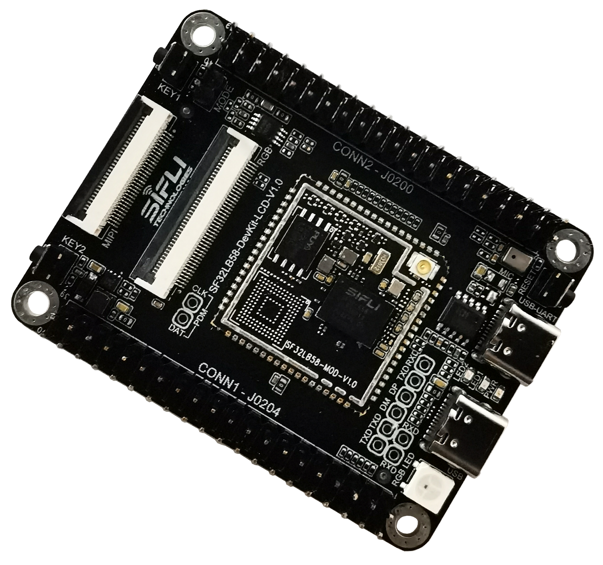

# sf32lb58-lcd_e4r32n1_dsi
`sf32lb58-lcd_e4r32n1_dsi` board is based on SF32LB58-DevKit-LCD board and 
has module [SF32LB58-MOD-E4R32N1](https://wiki.sifli.com/silicon/%E6%A8%A1%E7%BB%84%E5%9E%8B%E5%8F%B7%E6%8C%87%E5%8D%97.html#sf32lb58-mod) on the board. 
This variant uses eMMC for external storage while keeping the `8.0 rect DSI Video TFT LCD(800x1280 TFT-H080A11HDIFT4C30_V0-1)` as the default display.

