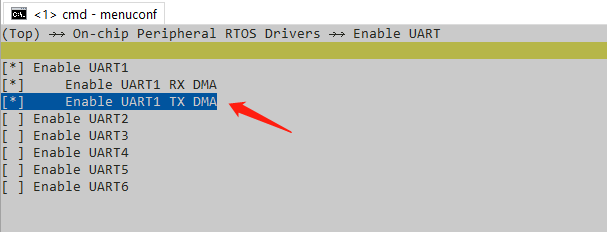
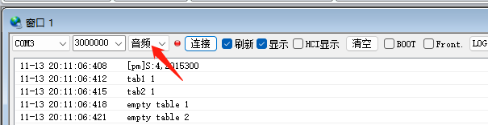
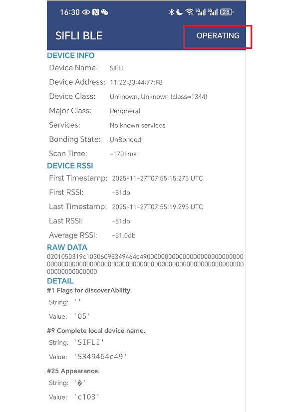
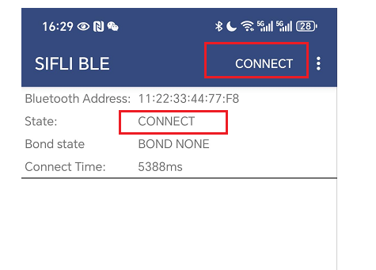
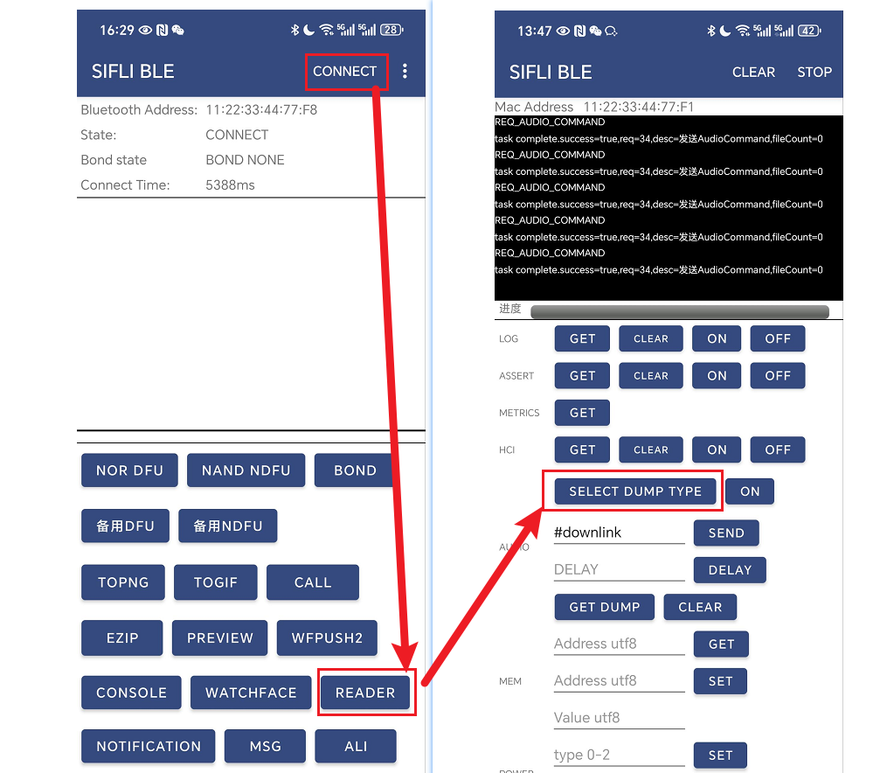
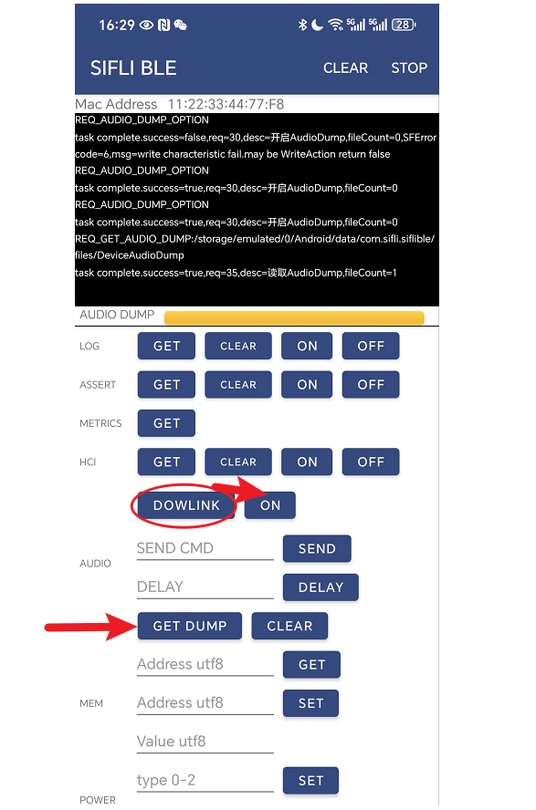
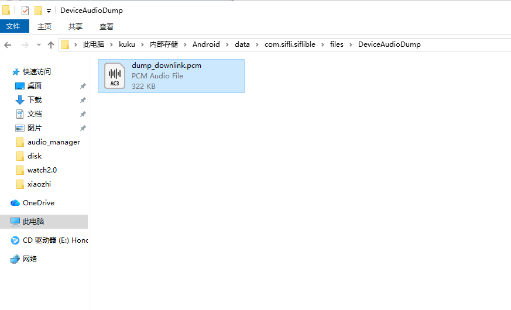

# Audio PCM Raw Data Dump
 Sometimes it is necessary to examine the raw audio data, such as gain levels and noise, by saving the data at nodes where the audio data passes through for offline analysis. Currently, two methods are supported: using the `siflitrace` tool to dump audio data in real-time via serial port or saving audio PCM data to a file for later export and analysis. Only scenarios involving both microphone and speaker operation are currently supported for data dumping. For file-based methods, it is preferable to store files on the NAND flash file system rather than the NOR flash (as speed may be insufficient). When dumping audio data, ensure the BT HCI log is disabled. You can use `nvds update hci_log 0` to disable it, then restart the device.
## 1 Dump via serial port
### 1.1 Serial port configuration
To use serial port dump, DMA should be used to enable the tx DMA configuration for the corresponding serial port. For example, if serial port 1 is used, BSP_UART1-TX-USING-DMA should be enabled

 

Calculate how many data streams need to be dumped at the same time, and whether it is necessary to increase the baud rate of the serial port RT_SRIAL_DFAUULTRATE

 

For example, if three 16k sampling rates of call data are dumped simultaneously, and 16k * 3 * 2=80k or more, the default 1M baud rate is not very rich, and it is best to change it to 1500000 baud rate.
The higher the baud rate, the better. Some USB serial port adapters may not meet the set baud rate, which can cause data loss. Using the default 1M baud rate, it is possible to dump two data streams at once.
### 1.2 software configuration
- Check these two in audio_Server. c, the default values are as follows (only supports serial port dump)
```c
#define AUDIO_DATA_CAPTURE_UART
//#define AUDIO_DATA_CAPTURE_FILE
```
- If you want to support saving to a file, change it to this way: file dump mode takes priority, and serial port dump becomes invalid
```c
#define AUDIO_DATA_CAPTURE_UART
#define AUDIO_DATA_CAPTURE_FILE
```
- enable RT_USING_FINSH in RT-thread
To dump data through serial port, you need to input the command 'audio_data' through the serial port, which corresponds to the command function 'audio_data_cmd()' in audio_Server. c. Enter 'help' through the serial port, and you should be able to see the command 'audio_data'.
### 1.3 dump Tool
Download and install the new SifliTrace tool(https://wiki.sifli.com/tools/index.html)
After opening the tool, select the serial port for logging the large core, select the audio, and then click connect. You should be able to see the large core log, and then you can enter the audio_data command to dump data (the system cannot sleep, otherwise the command cannot be entered)  

 

The parameters after the audio_data command indicate which data channels can be dumped (if the serial port baudrate is not high, it cannot carry too much)  

 

The meaning of different algorithm parameters varies, depending on the code in the manual. The default webRTC parameter meanings are as follows (different versions may have differences, depending on the code in the manual)  
```
-audprc         data from mic
-downlink       BT downlink data
-downlink_agc   BT downlink data with agc which will send to speaker
-aecm_out       Data after echo cancellation algorithm
-ramp_out_out   Data sending to BT
```
The system log cannot be seen during the dump data process. Entering audio_data - stop after the dump stops the dump data and restores the system log printing. Some versions will crash during this process. It may be that LOG_HEX was called during the middle note, but LOG_HEX is still using the serial port. The newer version has solved the problem. After dumping the data, click "Save" on the tool. The dump result will be found in the xxx_audio directory of the tool's log directory, and the latest date will be the current dump date

 

The correspondence between types and parameters in commands can be found in the audio_data_cmd() function in audio_derver. c
```
    ADUMP_DOWNLINK      -downlink
    ADUMP_DOWNLINK_AGC  -downlink_agc
    ADUMP_AUDPRC        -audprc
    ADUMP_DC_OUT        -dc_out
    ADUMP_RAMP_IN_OUT   -ramp_in_out
    ADUMP_AECM_INPUT1   -aecm_input1
    ADUMP_AECM_INPUT2   -aecm_input2
    ADUMP_AECM_OUT      -aecm_out
    ADUMP_ANS_OUT       -ans_out
    ADUMP_AGC_OUT       -agc_out
    ADUMP_RAMP_OUT_OUT  -ramp_out_out
    ADUMP_PDM_RX        -pdm
```
A typical dump is to add a dump before and after the algorithm in audio_3a *. c, usually only dumping the algorithm input and output. Depending on which type of dump is used for each data channel in the corresponding version, the corresponding parameters are used.
If Ankai algorithm is used, corresponding to audio_3a_anyka. c, it supports these parameters
```
-audprc       data from mic
-downlink     BT downlink data
-downlink_agc BT downlink data with agc which will send to speaker
-aecm_input1  Data after echo cancellation algorithm
-aecm_input2  data from mic
-ramp_out_out Data sending to BT
```

## 2. Modify dump type
If you want to modify it yourself, search for where to call audio_rump_data(). The first parameter represents the type and cannot be added by yourself. The tool will not recognize it after adding it
There are currently so many types:
```c
typedef enum
{
    ADUMP_DOWNLINK = 0,
    ADUMP_DOWNLINK_AGC,
    ADUMP_AUDPRC,
    ADUMP_DC_OUT,
    ADUMP_RAMP_IN_OUT,
    ADUMP_AECM_INPUT1,
    ADUMP_AECM_INPUT2,
    ADUMP_AECM_OUT,
    ADUMP_ANS_OUT,
    ADUMP_AGC_OUT,
    ADUMP_RAMP_OUT_OUT,
    ADUMP_PDM_RX,
    ADUMP_NUM,
} audio_dump_type_t;
```
Adding data of the same type can only be used by one channel of data, and two channels of data cannot use the same type to cause data confusion
## BLE Audio Dump

If you want to support saving to a file, change it to this way: file dump mode takes priority, and serial port dump becomes invalid
```c
#define AUDIO_DATA_CAPTURE_UART
#define AUDIO_DATA_CAPTURE_FILE
```
### FAQ1 How to use SiFliBleApp to dump audio data

- Purpose: Use SIFLI BLE APP to dump audio data and export the data to mobile devices.
- After downloading and installing SifliBleApp, click the search button and then click SORT to refresh the device. Connect to BLE based on the MAC address and click on the device to view its information.

  

- After clicking in, click Operating.



- Click CONNECT, note: The connection process needs to wait for a while, when the state is CONNECT.



- After connecting to BLE, click READER, then click SELECT DUMP TYPE to select the data type that needs to be dumped. For example, choose DOWLINK, select Finish, and click ON to start dumping data





### FAQ2 software code for Ble_Audio_dump

- The dump data needs to be saved into the file system, with a defined save path and file name. All dump files are saved in the root directory.


- When using ble dump audio data, there may be an error stating that the DOWNLINK_STANCK_SIZE is not enough. You can try increasing the DOWNLINK_STANCK_SIZE slightly.


- Note: Using BLE to dump audio data may conflict with UART to dump audio data. So you can define another AUDIO_daTA_CPTUREFHIR LE macro, and once it is defined, it will not execute audio_dataw_rite_art().


- If we need to adjust the dump data entered by d_record_time, we can use a custom command to set the input time by using the "time=" command. For example, in the SIFLI BLE APP, we can input "time=15" into the SEND and set the duration of dump data entry to 15.


### FAQ3 How to export dump files using SiFliBleApp

- After the dump is completed, you can export the file to your mobile device using GET DUMP


- This file will be stored in the Android/data/com. sifli. siflible/files/DeviceAudioDump directory on the mobile device.


