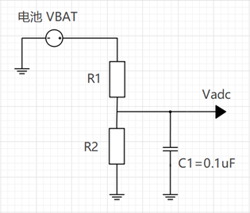
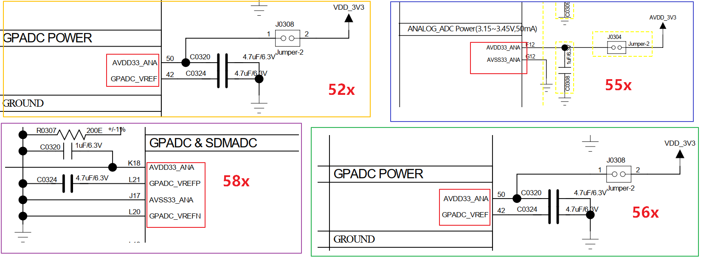

# ADC 使用与配置指南

## 1. 概述
ADC（模数转换器）用于将模拟信号（如传感器输出、电池电压等）转换为数字信号。

- **通道数量**：共 8 个通道（通道 0 ~ 7）。
- **特殊通道**：在 `SF32LB52x` 系列中，**通道 7** 固定用于电池电压检测（VBAT 经电阻分压后输入）。
- **数据处理**：ADC 输出值需结合硬件分压网络和软件校准值，才能计算出实际电压。

---

## 2. 芯片型号与参数对比
不同型号芯片的 ADC 参数存在显著差异，请根据实际硬件选型参考以下配置：

| 特性 | SF32LB55x | SF32LB56x / 58x / 52x |
| :--- | :--- | :--- |
| **采样位宽** | 10 bit | 12 bit |
| **采样精度** | 3~4 mV | 1~2 mV |
| **最大采样电压** | 1.1 V | 3.3 V |
| **推荐外部分压电阻** | 1000k / 220k | 470k / 1000k |
| **RC 稳定时间** | 157 ms | 200 ms |

> **💡 提示**：请务必根据上述参数选择合适的外部分压电阻，以确保输入电压不超过 ADC 的最大采样电压，防止损坏芯片。

---

## 3. ADC 校准机制
由于制造工艺差异，ADC 实际电压与理想电压存在偏差。系统通过出厂校准值进行补偿。

- **校准原理**：软件读取芯片出厂校准值，用于修正测量结果。
- **精度影响**：外部分压电阻的精度直接影响最终测量精度。
- **产线建议**：建议在客户产线进行分压网络的单独校准，以消除电阻误差。



---

## 4. 供电与参考电压 (AVDD & VREF)
ADC 仅有一路模拟电源，配置需严格遵守以下规范：

- **AVDD33_ANA**：3.3V 模拟电源，必须稳定接入。
- **GPADC_VREF**：内部参考电压引脚，非独立供电域。

不同平台对 `GPADC_VREF` 的处理方式不同：
1. **部分平台**：将 GPADC_VREF 外接电容接地。
2. **部分平台**：无外部引出端，仅由内部参考电压提供。

> **⚠️ 重要警告**：ADC 的供电电源必须接入 **AVDD33_ANA**，**严禁**直接将电源加到 GPADC_VREF 引脚上。



---

## 5. 引脚 (PAD) 配置
ADC 引脚通常通过设置 PIN 为模拟功能来配置。

### 5.1 通用配置示例
```c
// 通用模拟引脚设置
HAL_PIN_Set_Analog(PAD_PB08, 0);
HAL_PIN_Set_Analog(PAD_PB13, 0);
```

### 5.2 SF32LB55x 专用配置
在 SF32LB55x 上，可直接将 PIN 映射到具体 GPADC 通道：
```c
HAL_PIN_Set(PAD_PB08, GPADC_CH0, PIN_NOPULL, 0);
HAL_PIN_Set(PAD_PB13, GPADC_CH3, PIN_NOPULL, 0);
```

### 5.3 ADC PAD 通道分布表
不同型号芯片的引脚映射关系如下：

| 通道 | GPADC_CH0 | GPADC_CH1 | GPADC_CH2 | GPADC_CH3 | GPADC_CH4 | GPADC_CH5 | GPADC_CH6 | GPADC_CH7 |
| :--- | :--- | :--- | :--- | :--- | :--- | :--- | :--- | :--- |
| **SF32LB55x** | PB08 | PB10 | PB12 | PB13 | PB16 | PB17 | PB18 | PB19 |
| **SF32LB52x** | PA28 | PA29 | PA30 | PA31 | PA32 | PA33 | PA34 | BAT |
| **SF32LB56x** | PB22 | PB23 | PB24 | PB25 | PB26 | PB27 | PB28 | PB32 |
| **SF32LB58x** | PB32 | PB33 | PB34 | PB35 | PB36 | PB37 | PB38 | PB39 |

---

## 6. 软件使用接口
系统默认将 ADC 注册为电池电压设备，设备名为 `bat1`。

### 6.1 设备接口调用 (RT-Thread)
```c
uint32_t chnl = 1; // 指定通道
uint32_t value;
rt_device_t dev = rt_device_find("bat1");

if (dev) {
    rt_device_open(dev, RT_DEVICE_FLAG_RDONLY);
    rt_device_control(dev, RT_ADC_CMD_ENABLE, (void *)chnl);
    rt_device_read(dev, chnl, &value, 1);
}
```

### 6.2 HAL 接口调用
若使用 HAL 库，可直接通过以下接口获取原始值：
```c
HAL_ADC_GetValue(channel);
```

---

## 7. 电压计算与校准
ADC 值与输入电压呈线性关系。实际电压计算公式如下：

$$ V_{real} = (Value_{adc} - Offset) \times Ratio $$

其中：
- **Offset**：寄存器值对应 0V 时的偏移量。
- **Ratio**：每增加一个寄存器值对应的电压增量（斜率）。

### 7.1 校准方法
通过两个已知电压点确定参数（建议避免使用 0V 或最大电压作为校准点）：
1. 输入两个准确且稳定的电压值（55x:0.3V 和 0.8V,56x/52x/58x:1.0v和2.5v）。
2. 读取对应的 ADC 寄存器值。
3. 计算斜率和偏移。
4. 保存参数供后续使用。

### 7.2 参考代码实现
```c
// 全局变量定义
static uint32_t adc_vol_offset = 200;
static uint32_t adc_vol_ratio = 3930;
#define ADC_RATIO_ACCURATE 1000

// 将 ADC 值转换为毫伏 (mV)
int sifli_adc_get_mv(uint32_t value) {
    return (value - adc_vol_offset) * adc_vol_ratio / ADC_RATIO_ACCURATE;
}

// 校准函数
int sifli_adc_calibration(uint32_t value1, uint32_t value2,
                          uint32_t vol1, uint32_t vol2,
                          uint32_t *offset, uint32_t *ratio) {
    uint32_t gap1, gap2;

    if (offset == NULL || ratio == NULL) return 0;

    gap1 = (value1 > value2) ? (value1 - value2) : (value2 - value1);
    gap2 = (vol1 > vol2) ? (vol1 - vol2) : (vol2 - vol1);

    if (gap1 == 0) return 0;

    *ratio = gap2 * ADC_RATIO_ACCURATE / gap1;
    adc_vol_ratio = *ratio;

    *offset = value1 - (vol1 * ADC_RATIO_ACCURATE / adc_vol_ratio);
    adc_vol_offset = *offset;

    return adc_vol_offset;
}
```
