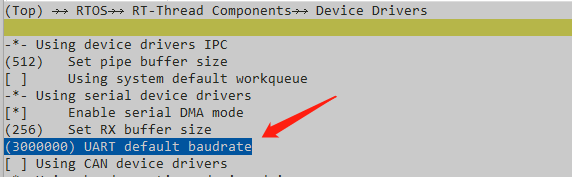
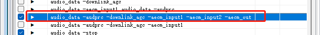
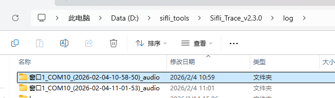
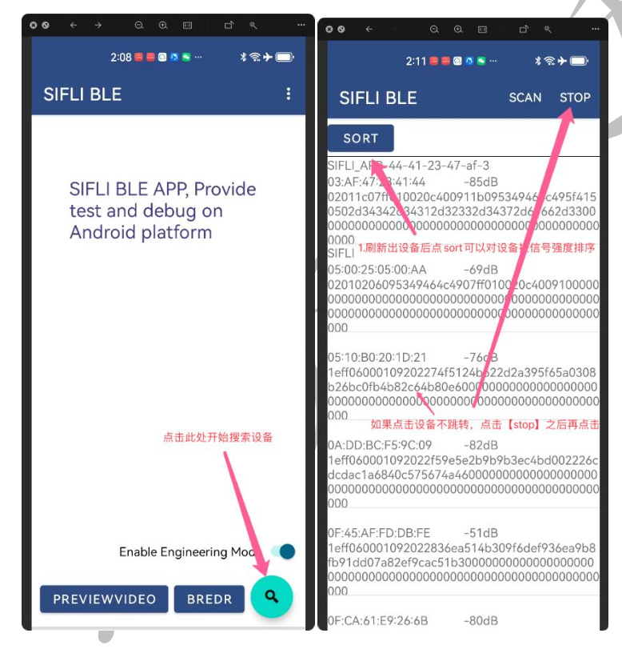
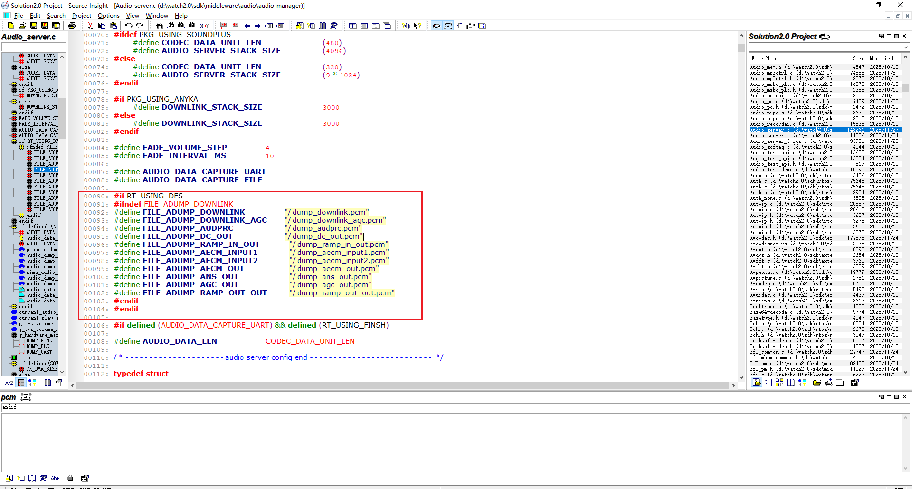
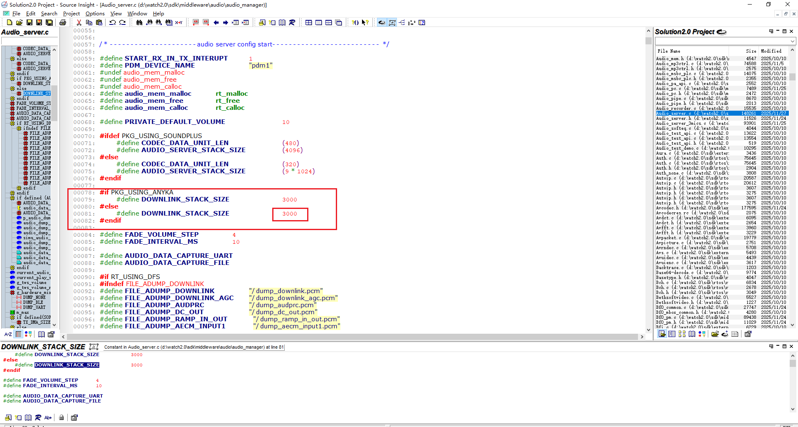
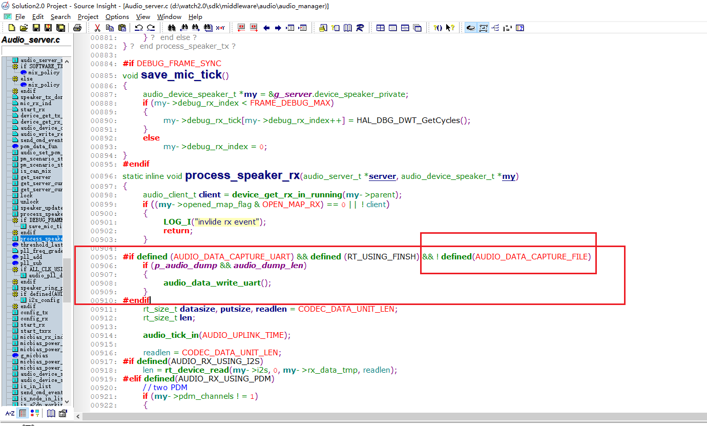
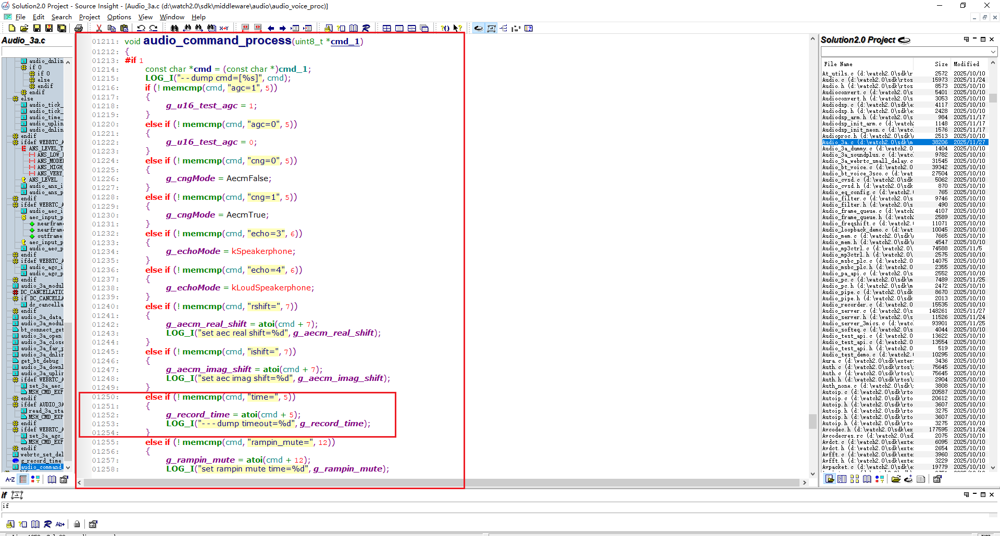
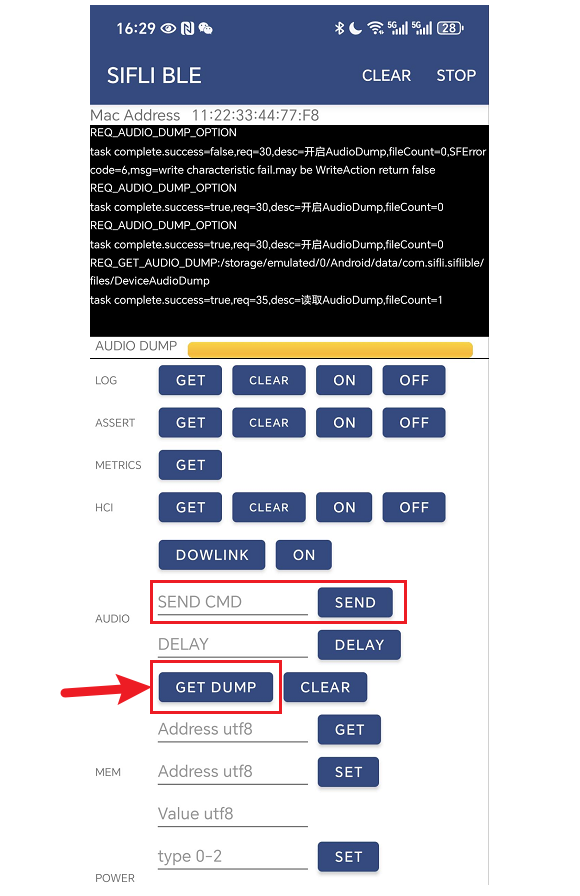

# Audio PCM原始数据dump方法
 有时需要看原始的音频数据，比如增益大小，噪声等，要在音频数据经过的节点上，把数据保存起来离线分析下。 目前支持用通过`siflitrace`工具用串口实时dump音频数据和把音频PCM数据保存到文件，再把文件导出来分析两种方式选一种。目前只支持mic和喇叭一起工作的场景才能dump数据， 文件的方式最好是文件系统在nand flash上，而不是在nor flash上(速度可能不够)。dump audio数据时，确保BT HCI log关闭了，可以用nvds update hci_log 0关闭下再重启机器。
## 1 用串口dump
### 1.1 串口配置
用串口dump需要用dma的方式，把对应串口的tx dma配置打开，比如用的串口1，则打开BSP_UART1_TX_USING_DMA
 

同时计算下要同时dump几路数据，是否需要提高串口的波特率RT_SERIAL_DEFAULT_BAUDRATE
 

比如同时dump三路16k采样率的通话数据， 16k * 3 * 2 = 80k以上，则默认的1M波特率不太富裕，最好改为1500000波特率。
不是波特率越高越好，有的usb串口转接板质量达不到设定的波特率会造成数据丢失，用默认的1M波特率，一次同时dump两路数据是可以的。
### 1.2 代码配置
- 检查下audio_server.c里这两个,默认值是这样的(只支持串口dump)
```c
#define AUDIO_DATA_CAPTURE_UART
//#define AUDIO_DATA_CAPTURE_FILE
```
- 如果要支持保存到文件，则改为这样的，文件dump方式优先，串口dump就失效了
```c
#define AUDIO_DATA_CAPTURE_UART
#define AUDIO_DATA_CAPTURE_FILE
```
- 打开rt thread的FINSH命令，RT_USING_FINSH
串口dump数据需要用串口输入`udio_data`命令， 对应audio_server.c里audio_data_cmd()这个命令函数，串口输入help，应该能看到audio_data这个命令。
### 1.3 工具使用
下载安装新的SifliTrace工具(https://wiki.sifli.com/tools/index.html)
打开工具后，选择大核打log的串口，选择音频后再点击连接，应能看到大核log，然后就可以输入audio_data命令dump数据(系统不能睡眠，不然无法输入命令)
 
audio_data命令后面的参数表示可以dump哪几路数据（串口波特率不高的话，不能带太多）
 
不同算法参数的含义不同，具体要看下手里的代码，默认webrtc参数含义如下(不同版本可能有差异，具体要看下手里的代码)
```
-audprc 原始mic的采集数据
-downlink 原始的蓝牙电话下行数据
-downlink_agc 蓝牙电话下行数据经过算法后的数据，也是喇叭播放前的数据
-aecm_out 回声消除算法后的数据
-ramp_out_out 上行送给BT的数据
```
dump数据过程中看不到系统log，dump后输入audio_data -stop 就是停止dump数据，恢复系统log打印，有的版本这过程会死机，可能是这过程中调了LOG_HEX， 而LOG_HEX还在使用串口导致，较新版本已解决。dump数据后点击工具上的保存，dump的结果在工具的log目录下有xxx_audio目录，较新的日期就是当前dump的
 

类型和命令里的参数对应关系见audio_server.c里audio_data_cmd()函数
```
    ADUMP_DOWNLINK      -downlink
    ADUMP_DOWNLINK_AGC  -downlink_agc
    ADUMP_AUDPRC        -audprc
    ADUMP_DC_OUT        -dc_out
    ADUMP_RAMP_IN_OUT   -ramp_in_out
    ADUMP_AECM_INPUT1   -aecm_input1
    ADUMP_AECM_INPUT2   -aecm_input2
    ADUMP_AECM_OUT      -aecm_out
    ADUMP_ANS_OUT       -ans_out
    ADUMP_AGC_OUT       -agc_out
    ADUMP_RAMP_OUT_OUT  -ramp_out_out
    ADUMP_PDM_RX        -pdm
```
一般的dump就是在audio_3a*.c里的算法前和算法后加dump，一般就是只dump算法输入和算法输出，要看对应版本每路数据用了那个类型dump，就用对应的参数。
如果用了安凯算法，对应audio_3a_anyka.c, 里面支持这几个参数
```
-audprc 原始mic的采集数据
-downlink 原始的蓝牙电话下行数据
-downlink_agc 蓝牙电话下行数据经过算法后的数据， 也是喇叭播放前的数据
-aecm_input1 喇叭播放前的信号(回声消除参考信号)
-aecm_input2 原始mic的采集数据
-ramp_out_out 算法后上行送给BT的数据
```

## 2. 修改dump类型
如果要自己修改，搜索哪里调了audio_dump_data(), 第一个参数表示类型，不能自己添加，添加后工具不会识别,目前有这么多类型：
```c
typedef enum
{
    ADUMP_DOWNLINK = 0,
    ADUMP_DOWNLINK_AGC,
    ADUMP_AUDPRC,
    ADUMP_DC_OUT,
    ADUMP_RAMP_IN_OUT,
    ADUMP_AECM_INPUT1,
    ADUMP_AECM_INPUT2,
    ADUMP_AECM_OUT,
    ADUMP_ANS_OUT,
    ADUMP_AGC_OUT,
    ADUMP_RAMP_OUT_OUT,
    ADUMP_PDM_RX,
    ADUMP_NUM,
} audio_dump_type_t;
```
加同一个类型数据只能被一路数据使用，不能两路数据使用同一个类型造成数据混淆
## BLE Audio Dump

如果要支持保存到文件，则改为这样的，文件dump方式优先，串口dump就失效了
```c
#define AUDIO_DATA_CAPTURE_UART
#define AUDIO_DATA_CAPTURE_FILE
```
### FAQ1 如何使用SiFliBleApp去dump audio数据

- 目的：使用SIFLI BLE APP 去dump audio数据，并可以将数据导出存在手机端。
- 首先下载安装SifliBleApp后，点击搜索键后点击SORT刷新设备，根据mac地址进行ble连接，点击该设备即可进入查看设备信息。

  

- 点击进去之后，点击OPERATING。


- 点击CONNECT，注意：连接过程需要等待一会，当state为CONNECT时即可。


- ble连接之后点击READER，然后点SELECT DUMP TYPE，可以选择需要dump的数据类型，比如：选择DOWLINK，选择完成点击ON即可开始dump数据


### FAQ2 Ble_Audio_dump代码使用说明

- dump的数据需要保存进文件系统里面，定义保存路径以及文件名，所有dump 文件保存在根目录下。



- 使用ble dump audio数据时可能会报DOWNLINK_STACK_SIZE不够的错误，可以试着把DOWNLINK_STACK_SIZE稍微改大一点。



- 注意：我们使用ble去dump audio数据会与UART去dump audio 数据有冲突。所以可以再定义一个AUDIO_DATA_CAPTURE_FILE宏，定义了就不执行audio_data_write_uart()。



- 如果我们需要调整g_record_time录入的dump数据，可以使用自定义command来设置，使用 “time=” 这个指令就可以来设置录入时间。 比如我们在SIFLI BLE APP中的SEND输入“time=15”,即可以把录入dump数据时长设置为15。



### FAQ3 如何使用SiFliBleApp将dump的文件导出

- dump结束之后，就可以通过GET DUMP来导出文件到手机端了



- 该文件会存在手机端Android/data/com.sifli.siflible/files/DeviceAudioDump目录下。


