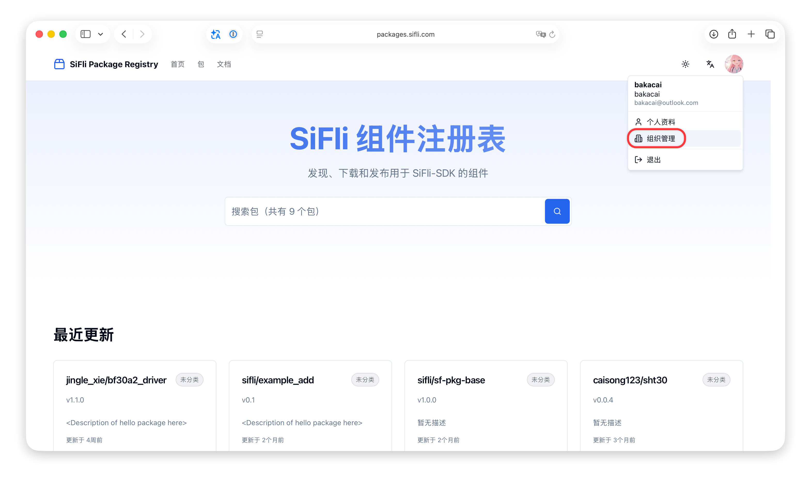
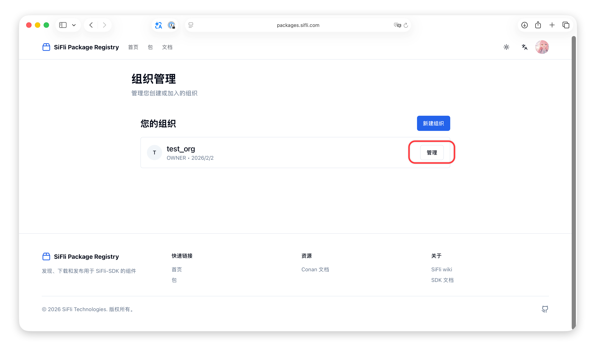
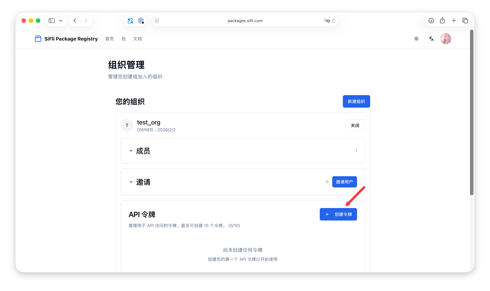
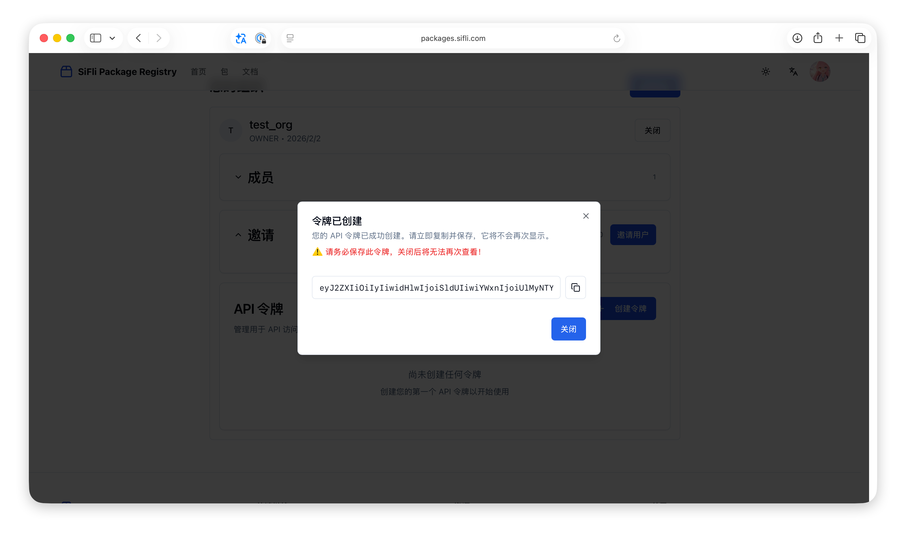

# 创建并上传 SiFli 组件包

本节介绍如何登录、创建、构建并上传 SiFli 组件包。

## 获取个人访问令牌

1. 打开 <https://packages.sifli.com/zh>，使用 GitHub 账号登录，用户名即为 GitHub 用户名（全小写）。
2. 登录后进入 **Profile**。
3. 在个人中心申请访问令牌（Token），并妥善保存，后续用于 `sdk.py sf-pkg-login` 命令。


```{note}
每个用户在每台电脑只需登录一次，登录信息会加密保存在本地，可同时保存多个用户。
```

## 登录 SiFli 组件注册表

```bash
sdk.py sf-pkg-login -u <namespace> -t 获取的 token
```


```{warning}
-u 参数可以在个人资料的命名空间处找到。
```

## 多用户管理与用户选择

查看本地已登录用户：

```bash
sdk.py sf-pkg-users
```

切换当前活跃用户：

```bash
sdk.py sf-pkg-use --name <namespace>
```

查看当前活跃用户：

```bash
sdk.py sf-pkg-current-user
```

说明：

- 当前用户会映射到同名 Conan 远端，后续远端操作会使用 `-r=<namespace>`。
- 未选择用户时，远端命令会提示先 `sf-pkg-login` 或 `sf-pkg-use`。
- 如果检测到用户同名远端缺失、地址不匹配或认证用户不一致，会自动清理该用户本地凭据并提示重新登录。
- 执行 `sf-pkg-logout --name <namespace>` 时，会同时清理该用户同名 Conan 远端配置。

如果只想对某一次命令临时指定用户，可使用全局参数 `--user`：

```bash
sdk.py --user <namespace> sf-pkg-upload --name 包名/版本号@命名空间
```

## 创建包配置（sf-pkg-new）

准备驱动文件夹后，在终端进入该目录并执行：

```bash
sdk.py sf-pkg-new --name <package_name>
```

默认使用当前活跃用户；如需临时指定用户，可使用：

```bash
sdk.py --user <namespace> sf-pkg-new --name <package_name>
```

可选参数：

- `--version`：包版本号
- `--license`：许可证声明
- `--author`：作者
- `--support-sdk-version`：支持的 SiFli-SDK 版本

示例（携带版本和作者信息）：

```bash
sdk.py sf-pkg-new --name <package_name> --version 1.0.0 --author yourname
```

命令成功后会生成一个 `conanfile.py` 文件，具体的描述可以参考 [Conan 官方文档](https://docs.conan.io/en/latest/reference/conanfile.html)。

一般来说，`conanfile.py` 文件中内容默认如下：

```python
from conan import ConanFile

class Example_AddRecipe(ConanFile):
    name = "example_add"
    version = "0.1.0"

    license = "Apache-2.0"
    user = "halfsweet"
    author = "halfsweet"
    url = "<Package recipe repository url here, for issues about the package>"
    homepage = "<Package homepage here>"
    description = "<Description of hello package here>"
    topics = ("<Put some tag here>", "<here>", "<and here>")

    support_sdk_version = "^2.4"

    # Sources are located in the same place as this recipe, copy them to the recipe
    exports_sources = "*"

    python_requires = "sf-pkg-base/[^1.0]@sifli"
    python_requires_extend = "sf-pkg-base.SourceOnlyBase"

    def requirements(self):
        # add your package dependencies here, for example:
        # self.requires("fmt/8.1.1")
        pass
```

我们需要着重关注以下参数：
- `name`：包名称，必填项，用于在`https://packages.sifli.com`中作为唯一标识。
- `version`：包版本号，建议使用语义化版本号，如 `0.0.1`、`1.0.0` 等。
- `user`：在 `https://packages.sifli.com` 上的命名空间，也叫`namespace`，必选项。
- `license`：开源协议，常见的有 `Apache-2.0`、`MIT`、`GPL-3.0`、`BSD-3-Clause` 等，默认是 `Apache-2.0`。
- `author`：包作者/维护者名称，可选项。
- `url`：包的仓库地址 （GitHub/GitLab 等），可选项。
- `description`：包的详细描述，可选项。
- `topics`：包的标签/主题，便于搜索和分类，使用元组形式，可选项。
- `support_sdk_version`：支持的 SiFli-SDK 版本，必选项，格式为 [语义化版本范围](https://semver.org/)。

其中，`user`和`name`组合起来将作为包的唯一标识。

`requirements` 方法用于添加依赖包

```python
def requirements(self):
    # add your package dependencies here, for example:
    # self.requires("fmt/8.1.1")
    pass
```

在这里代表了什么都没有添加任何依赖包。我们可以在 `requirements` 方法中添加需要的包，例如：

```python
def requirements(self):
    self.requires("sht30/0.0.4@caisong123")
```

`self.requires` 用于指定依赖包，其中的格式为 `包名/版本号@用户名`。

## 构建包（sf-pkg-build）

在驱动文件夹下执行：

```bash
sdk.py sf-pkg-build --version 版本号
```


> 版本号建议使用语义化版本号，如 `0.0.1`、`1.0.0` 等。

## 上传包（sf-pkg-upload）

```bash
sdk.py sf-pkg-upload --name 包名/版本号@命名空间
```

默认使用当前活跃用户；如需临时指定用户，可使用：

```bash
sdk.py --user <namespace> sf-pkg-upload --name 包名/版本号@命名空间
```


命令格式说明：

- `包名`：在 `conanfile.py` 中定义的包名
- `版本号`：构建时指定的版本号
- `命名空间`：个人资料中的显示项

### 上传失败的处理

1. 清除本地缓存：
   ```bash
   sdk.py sf-pkg-remove --name 包名
   ```
2. （可选）清除远端仓库中的包：
   ```bash
   sdk.py sf-pkg-remove --name 包名/版本号@命名空间 --remote
   ```
   说明：`--remote` 会删除当前用户同名远端（`-r=<namespace>`）中的包，执行前请先登录并确保用户状态有效。
3. 重新构建：
   ```bash
   sdk.py sf-pkg-build --version 版本号
   ```
4. 再次上传：
   ```bash
   sdk.py sf-pkg-upload --name 包名/版本号@命名空间
   ```

### 验证上传结果

上传成功后，可在服务器网站上看到已上传的包：


## 作为组织使用

组织用于对多个用户共同维护的组件包进行统一管理，是面向团队和企业级使用场景的核心功能。

组织可包含多个成员，不同成员可共享同一组织下的组件包与发布流程。

作为组织和作为个人使用时，大多数步骤均相同，只有令牌的获取方式和命名空间的不同。

### 创建组织令牌

1. 打开<https://packages.sifli.com/zh>，使用 GitHub 账号登录。
2. 登陆后进入组织管理。
3. 找到想要管理的组织，点击管理
4. 在组织管理申请访问令牌（Token），并妥善保存，后续用于 `sdk.py sf-pkg-login` 命令。






```{note}
组织 token 和个人 token 可以同时保存在本地，可通过 `sf-pkg-use` 或全局 `--user` 在不同命名空间间切换。
```

### 有关命名空间的说明

1. 当作为组织登陆时，命名空间实际上为组织名，所以在终端中登录时，命令为

    ```bash
    sdk.py sf-pkg-login -u <org_name> -t 获取的 token
    ```

    org_name为组织名

2. 在创建包配置时，author 的设定不受 namespace 的影响，其表示该组织内的作者，user 字段请确保与组织名一致，**不然无法成功上传组件包** 。
