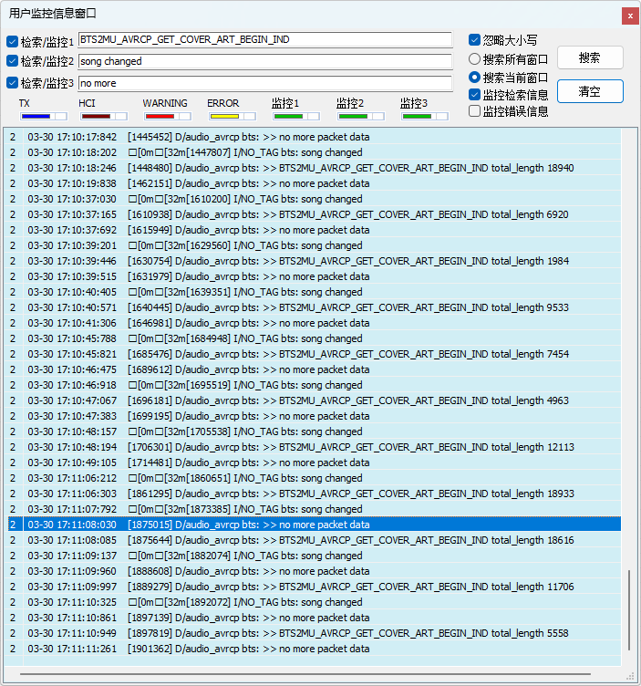

# BT music sink示例

源码路径：example/bt/avrcp_cover_art

{#Platform_avrcp_cover_art}
## 支持的平台
<!-- 支持哪些板子和芯片平台 -->
+ eh-lb52x
+ eh-lb56x
+ eh-lb58x
+ sf32lb52-lcd系列
+ sf32lb56-lcd系列
+ sf32lb58-lcd系列

## 概述
<!-- 例程简介 -->
本例程演示在通过蓝牙连接手机等A2DP Source设备后，在本机播放source设备的音乐,并且获取手机端正在播放音乐的封面图。


## 例程的使用
<!-- 说明如何使用例程，比如连接哪些硬件管脚观察波形，编译和烧写可以引用相关文档。
对于rt_device的例程，还需要把本例程用到的配置开关列出来，比如PWM例程用到了PWM1，需要在onchip菜单里使能PWM1 -->
例程开机会打开蓝牙的Inquiry scan和psage scan，用手机等A2DP source设备可以搜索到本机并发起连接，连上以后即可播放手机音乐，在歌曲切换时会尝试获取封面。(<mark>只有Iphone 7以后的Iphone手机和部分Android手机支持改功能，Android手机的支持可参考https://guide.hiby.com/docs/question/bt_reciver/bt_cover_support</mark>)
<mark>如果有使用文件系统，则会在本地生成一个cover.JPEG文件用于存放封面图。</mark>
本设备的蓝牙名称默认是sifli_avrcp_cover_art。

1. 获取收封面图：
在切换歌曲后，会在打印中看到如下信息则说明获取封面成功，如果有文件系统则可以在文件系统里看到cover.JPEG文件，可以导出到电脑端查看。


### 硬件需求
运行该例程前，需要准备：
+ 一块本例程支持的开发板（[支持的平台](#Platform_music_sink)）。
+ 喇叭。

### menuconfig配置
1. 使能AUDIO CODEC 和 AUDIO PROC：
    - 路径：On-chip Peripheral RTOS Drivers
    - 开启：Enable Audio Process driver
        - 宏开关：`CONFIG_BSP_ENABLE_AUD_PRC`
        - 作用：使能Audio process device，主要用于音频数据处理（包括重采样、音量调节等）
    - 开启：Enable Audio codec driver
        - 宏开关：`CONFIG_BSP_ENABLE_AUD_CODEC`
        - 作用：使能Audio codec device，主要用于进行DAC转换
2. 使能AUDIO(`AUDIO`)：
    - 路径：Sifli middleware
    - 开启：Enable Audio
        - 作用：使能音频配置选项
3. 使能AUDIO MANAGER(`AUDIO_USING_MANAGER`)：
    - 路径：Sifli middleware → Enable Audio
    - 开启：Enable audio manager
        - 宏开关：`CONFIG_AUDIO_USING_MANAGER`
        - 作用：使用audio manager模块进行audio的流程处理
4. 使能蓝牙(`BLUETOOTH`)：
    - 路径：Sifli middleware → Bluetooth
    - 开启：Enable bluetooth
        - 宏开关：`CONFIG_BLUETOOTH`
        - 作用：使能蓝牙功能
5. 使能A2DP SNK和AVRCP：
    - 路径：Sifli middleware → Bluetooth → Bluetooth service → Classic BT service
    - 开启：Enable BT finsh（可选）
        - 宏开关：`CONFIG_BT_FINSH`
        - 作用：使能finsh命令行，用于控制蓝牙
    - 开启：Manually select profiles
        - 宏开关：`CONFIG_BT_PROFILE_CUSTOMIZE`
        - 作用：手动选择使能的配置文件
    - 开启：Enable A2DP
        - 宏开关：`CONFIG_CFG_AV`
        - 作用：使能A2DP
    - 开启：Enable A2DP sink profile
        - 宏开关：`CONFIG_CFG_AV_SNK`
        - 作用：使能A2DP SINK ROLE
    - 开启：Enable AVRCP
        - 宏开关：`CONFIG_CFG_AVRCP`
        - 作用：使能AVRCP profile
6. 使能BT connection manager：
    - 路径：Sifli middleware → Bluetooth → Bluetooth service → Classic BT service
    - 开启：Enable BT connection manager
        - 宏开关：`CONFIG_BSP_BT_CONNECTION_MANAGER`
        - 作用：使用connection manager模块管理bt的连接
7. 使能NVDS：
    - 路径：Sifli middleware → Bluetooth → Bluetooth service → Common service
    - 开启：Enable NVDS synchronous
        - 宏开关：`CONFIG_BSP_BLE_NVDS_SYNC`
        - 作用：蓝牙NVDS同步。当蓝牙被配置到HCPU时，BLE NVDS可以同步访问，打开该选项；蓝牙被配置到LCPU时，需要关闭该选项


### 编译和烧录
切换到例程project目录，运行scons命令执行编译：
```c
> scons --board=eh-lb525 -j32
```
切换到例程`project/build_xx`目录，运行`uart_download.bat`，按提示选择端口即可进行下载：
```c
$ ./uart_download.bat

     Uart Download

please input the serial port num:5
```
关于编译、下载的详细步骤，请参考[快速入门](/quickstart/get-started.md)的相关介绍。

## 例程的预期结果
<!-- 说明例程运行结果，比如哪几个灯会亮，会打印哪些log，以便用户判断例程是否正常运行，运行结果可以结合代码分步骤说明 -->
例程启动后：
手机类A2DP source设备可以连接上本机并播放音乐

## 异常诊断


## 参考文档
<!-- 对于rt_device的示例，rt-thread官网文档提供的较详细说明，可以在这里添加网页链接，例如，参考RT-Thread的[RTC文档](https://www.rt-thread.org/document/site/#/rt-thread-version/rt-thread-standard/programming-manual/device/rtc/rtc) -->

## 更新记录
|版本 |日期   |发布说明 |
|:---|:---|:---|
|0.0.1 |03/2026 |初始版本 |
| | | |
| | | |
