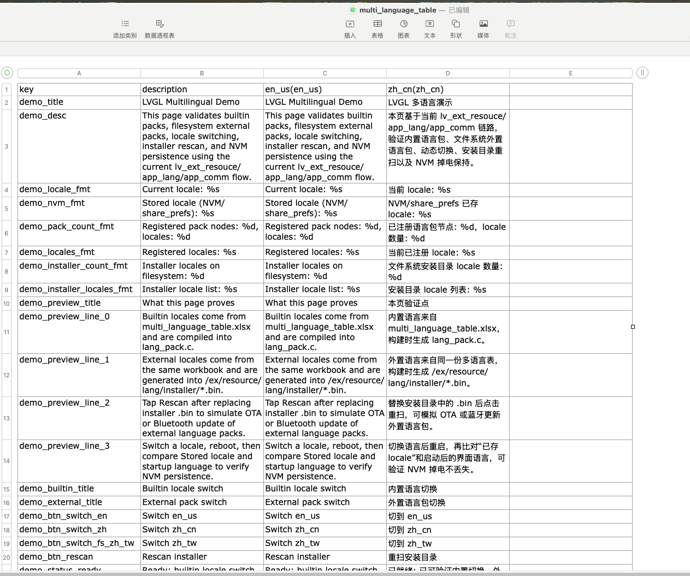

# LVGL 多语言 Example
## 介绍
本示例用于演示当前 SDK 中 `lv_ext_resouce` 多语言链路的基本能力，覆盖以下内容：

- 内置语言包加载
- 外置语言包安装与加载
- 运行时动态切换语言
- 文件系统安装目录重新扫描
- `share_prefs` 持久化当前语言
- `json` 与 `xlsx` 两类语言源的转换流程

本例程对应的核心代码路径如下：

- 例程入口：`example/multimedia/lvgl/Multilingual/src/app_utils/main.c`
- 内置/外置语言资源脚本：`example/multimedia/lvgl/Multilingual/src/resource/strings/`
- 多语言中间件：`middleware/lvgl/lv_ext_resouce/`

## 工程编译及下载
板子工程位于 `project` 目录下，可以通过指定 `board` 生成对应工程。

- 例如编译 `sf32lb52-lchspi-ulp`：

```bash
scons --board=sf32lb52-lchspi-ulp -j8
```

- 编译完成后，可使用构建目录中的下载脚本烧录：

```bash
build_sf32lb52-lchspi-ulp_hcpu/uart_download.sh
```

或在 Windows 下执行：

```bat
build_sf32lb52-lchspi-ulp_hcpu\uart_download.bat
```

对于支持 JLink 的环境，也可以使用：

```bat
build_sf32lb52-lchspi-ulp_hcpu\download.bat
```

## 支持的平台

- sf32lb52-lchspi-ulp

## 概述
本例程启动后会创建一个可滚动页面，界面中会展示：

- 当前生效的 locale
- `share_prefs` 中保存的 locale
- 当前已注册的语言包节点和 locale 列表
- 文件系统安装目录中的外置语言包列表
- 内置语言切换按钮
- 外置语言切换按钮
- 安装目录重新扫描按钮

当前 `main.c` 中默认验证的语言切换行为为：

- 内置：`en_us`
- 内置：`zh_cn`
- 外置：`zh_tw`
- 重新扫描外置安装目录：`/ex/resource/lang/installer`

## 目录结构
与多语言相关的关键目录如下：

```text
Multilingual/
├── project/
├── disk/
│   └── ex/resource/lang/installer/
├── src/
│   ├── app_utils/main.c
│   └── resource/
│       └── strings/
│           ├── SConscript
│           ├── in_lang_packs/
│           │   ├── SConscript
│           │   ├── json/
│           │   └── xlsx/
│           └── ex_lang_packs/
│               ├── SConscript
│               ├── json/
│               └── xlsx/
```

其中：

- `in_lang_packs` 表示内置语言包源
- `ex_lang_packs` 表示外置语言包源
- `disk/ex/resource/lang/installer/` 是外置语言包 `.bin` 的安装目录

## 内置与外置语言包
### 内置语言包
内置语言包会在构建阶段转换为 `lang_pack.c/.h`，并编译进固件。

当前默认输出位置为：

- `project/build_<board>_hcpu/src/resource/strings/lang_pack.h`
- `project/build_<board>_hcpu/src/resource/strings/lang_pack.c`

内置语言包的特点：

- 固化在固件中
- 启动即可用
- 适合作为默认语言集
- 当前例程用它验证 `en_us` 和 `zh_cn`

### 外置语言包
外置语言包会在构建阶段转换为 `.bin` 文件，并放入文件系统安装目录：

- `disk/ex/resource/lang/installer/*.bin`

这些 `.bin` 最终会被打包进文件系统镜像，例如：

- `project/build_<board>_hcpu/fs_root.bin`

运行时由以下链路加载：

- `app_lang_load_pack_list()` 扫描安装目录
- `app_lang_install_pack()` 安装指定语言包
- `app_locale_lang_update()` 切换当前 locale

外置语言包的特点：

- 不必重新编译主固件即可替换
- 适合 OTA、蓝牙、文件拷贝等更新场景
- 本例程通过“Rescan installer”来模拟重新扫描和重新加载

## 不同源转换流程
当前例程支持两类输入源：

- `json`
- `xlsx`

并且内置与外置可以独立选择，不要求必须同源。

例如以下组合都是允许的：

- 内置 `json`，外置 `json`
- 内置 `xlsx`，外置 `xlsx`
- 内置 `json`，外置 `xlsx`
- 内置 `xlsx`，外置 `json`

### 内置语言包转换
内置语言包支持两条转换链：

- `json -> lang_pack.c/.h`
- `xlsx -> lang_pack.c/.h`

对应脚本位于：

- `src/resource/strings/in_lang_packs/SConscript`

当前默认配置是：

```python
lang_mode = 'xlsx'
lang_sources = Glob('xlsx/*.xlsx')
```

如果需要切换回传统 `json` 模式，可改为：

```python
# lang_mode = 'xlsx'
# lang_sources = Glob('xlsx/*.xlsx')

lang_mode = 'json'
lang_sources = Glob('json/*.json')
```

### 外置语言包转换
外置语言包同样支持两条转换链：

- `json -> .bin`
- `xlsx -> .bin`

对应脚本位于：

- `src/resource/strings/ex_lang_packs/SConscript`

当前默认配置是：

```python
lang_mode = 'xlsx'
lang_sources = Glob('xlsx/*.xlsx')
```

如果要切换到 `json` 模式，可改为：

```python
# lang_mode = 'xlsx'
# lang_sources = Glob('xlsx/*.xlsx')

lang_mode = 'json'
lang_sources = Glob('json/*.json')
```

### 当前例程默认行为
当前 `src/resource/strings/SConscript` 的默认行为是：

- 内置：`xlsx -> c/h`
- 外置：`xlsx -> bin`

并且外置语言包默认版本号为：

```python
external_pack_version = 'v1.0.4'
```

## xlsx 表格式要求
`xlsx` 的语言表需要满足以下基本规则：

- 第 1 行是表头
- A 列是字符串 key
- B 列是描述或默认说明
- 从 C 列开始，每一列代表一种语言

表格格式示意如下：



语言列表头支持两种写法：

- `zh_tw`
- `zh_tw(zh_tw)`

两者在当前脚本中的效果相同，都会解析为：

- `stem = zh_tw`
- `locale = zh_tw`

只有在你希望“生成名”和“运行时 locale 名”不同的时候，才需要写成括号形式，例如：

- `zh_tw(繁體中文)`

此时：

- `zh_tw` 用于生成文件名、变量名
- `繁體中文` 用于运行时 locale 字符串

注意事项：

- `stem` 必须满足 C 标识符规则
- 同一个表中语言列不能重名
- 同一个表中 key 不能重复
- 外置语言包与内置语言包应保持同一套 key schema

## 例程的使用
### 编译和烧录
进入 `project` 目录后执行：

```bash
scons --board=sf32lb52-lchspi-ulp -j8
```

烧录后启动例程，界面会显示：

- 当前语言
- 已保存语言
- 已注册 locale 列表
- 安装目录 locale 列表
- 语言切换按钮

### 内置语言验证
点击以下按钮可验证内置语言切换：

- `Switch en_us`
- `Switch zh_cn`

验证点：

- 页面文本立即切换
- `Current locale` 更新
- `Stored locale` 更新

### 外置语言验证
点击以下按钮可验证外置语言：

- `Switch zh_tw`

前提条件：

- 文件系统安装目录中已经存在对应的 `zh_tw.bin`

验证点：

- `Installer locale list` 中能看到 `zh_tw`
- 切换后界面文本变为外置语言内容


### NVM 持久化验证
当前工程在 `proj.conf` 中启用了：

- `CONFIG_BSP_SHARE_PREFS=y`

因此语言切换后，当前 locale 会写入 `share_prefs`。

验证方法：

1. 切换到 `en_us`、`zh_cn` 或 `zh_tw`
2. 记录页面中的 `Stored locale`
3. 重启设备
4. 再次观察启动后的页面语言和 `Stored locale`

如果启动语言与保存值一致，说明持久化链路正常。

## 例程配置流程
本例程依赖以下关键配置：

- `CONFIG_LV_EXT_RES_NON_STANDALONE=y`
- `CONFIG_RT_USING_DFS_ELMFAT=y`
- `CONFIG_BSP_SHARE_PREFS=y`
- `CONFIG_LV_USING_FREETYPE_ENGINE=y`

作用分别是：

- 启用非 standalone 的外部资源管理模式
- 启用文件系统，支持外置语言包目录扫描
- 启用 `share_prefs`，用于保存当前语言
- 启用 FreeType 字体能力，提升多语言字符覆盖能力

## 注意事项
- `lang_pack.h` 是应用侧资源生成物，不是固定手写头文件，路径通常位于构建目录的 `src/resource/strings/`
- 如果新增语言切换成功但文本显示为空、乱码或方框，优先检查字体覆盖范围，而不是先怀疑语言包切换逻辑
- 当前例程默认外置语言验证项为 `zh_tw`，若增加泰文、高棉文等语言，需要同时补齐对应字体能力
- 切换 `json/xlsx` 源模式后，建议执行一次完整重编译，避免旧生成物残留

## 异常诊断
### 现象：界面上没有外置语言
可能原因：

- `disk/ex/resource/lang/installer/` 下没有对应 `.bin`
- 文件系统未正确挂载
- 构建时没有启用 `RT_USING_DFS_ELMFAT`

### 现象：语言切换按钮可点，但文本不变
可能原因：

- 当前 locale 不在已注册或已安装的语言包列表中
- 外置语言包与内置 `lang_pack.h` 的 key schema 不一致

### 现象：语言切换成功，但字符显示异常
可能原因：

- 当前字体不支持该语种的字符集
- FreeType 或字体资源未正确配置
