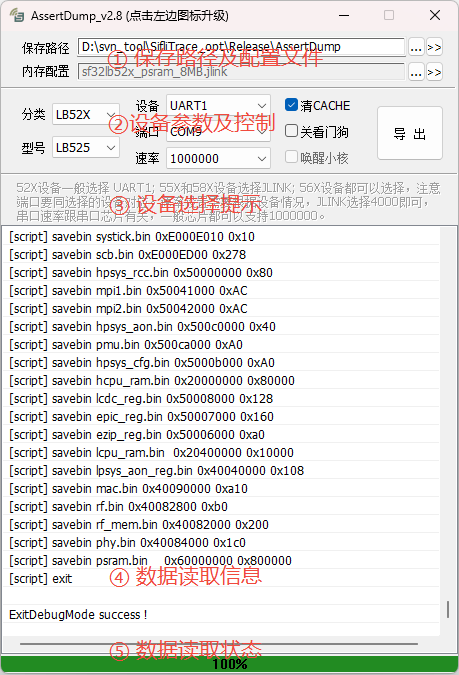

# AssertDump

## 1. 概述

AssertDump 是思澈公司自研工具，主要功能是保存目标板死机时的内存数据，再借助TRACE32软件恢复固件现场做进一步分析，该工具存放在 **固件包\solution\tools\AssertDump** 路径下。

## 2. 环境配置

AssertDump 免安装，可直接运行于WINDOWS系统，WINXP/WIN7/WIN10/WIN11…  

当使用JLink读取内存数据时，需要基于JLink硬件及其配套软件，建议操作如下：  

- 购买官方JLink设备并安装SEGGER官网JLink Windows软件，本工具调试使用的版本为V680a。  
- 在工具的配置文件AssertDump.ini中配置 JLinkARM.dll 路径，有两种方式：  
  - 不修改配置文件AssertDump.ini，直接将 JLinkARM.dll 文件拷贝到工具根目录下。
  - 修改配置文件AssertDump.ini  [COMMON]项目中的JLINKDLL子项。 eg: `JLINKDLL=C:\Program Files (x86)\SEGGER\JLink\JLinkARM.dll`

## 3. 功能介绍

  

工具主界面如图所示，主要包括5个区域：  
**① 保存路径及配置文件**

- **保存路径**  
  配置内存数据保存的路径，默认为工具当前路径，用户可以修改路径，保存数据时会在该路径下创建当时时间命名的文件夹中。后面两个按钮功能依次为 **选择路径** 和 **打开路径**。  
- **内存配置**  
  显示当前读取内存的配置文件，该文件同芯片直接绑定，客户可以临时选择其他配置文件，但配置不会保存，再次打开工具或者切换该芯片依然使用默认配置文件。后面两个按钮功能依次为 **选择配置文件** 和 **修改配置文件**。  

**② 设备参数及控制**  

- **分类**  
  用来选择目标板上芯片的大分类，如SF32LB525的大分类就是LB52X。  
- **型号**  
  用来选择目标板上芯片的具体型号。  
- **设备**  
  用来选择读取内存数据的通道，可以选择JLink或者串口，参考 **③ 设备选择提示**。  
- **端口**  
  设备选择后，此处选择串口号或SN号。  
- **速率**  
  设备选择后，此处选择串口或JLink速率，参考 **③ 设备选择提示**。  
- **清CACHE**  
- 读取的数据有些地址是配置了CACHE的，需要清CACHE才能读到最新的数据，该选项建议都勾选上。  
- **关看门狗**  
  如果目标板配置了看门狗，死机后可能会在导内存数据的过程中重启，此种场景需要选择关闭看门狗。  
- **唤醒小核**  
  该项默认起效。  
- **导出**  
  控制导出数据，在导出过程中可以控制结束流程。  

**③ 设备选择提示**  
  
  
  指导用户配置读取内存数据的设备及相关参数，具体内容如上图所示。 
  
  

**④ 数据读取信息**  
  

  显示数据读取过程中的trace信息，出现异常可以根据信息排查，带[script]前缀的是内存读取配置文件中的内容。  
  
  

**⑤ 数据读取状态**  
  

  显示数据读取进度及最终状态，导出失败显示为红色，成功为绿色，一般来说进度为100%的时候导出的数据就可以使用。  
  
  

## 4. 使用方法

工具使用比较简单，双击打开工具，按如下步骤操作：

- 确认目标板的芯片型号，选择对应的 **分类** 和 **型号**。
- 参照 **③设备选择提示** 的信息，选择设备/端口/速率。
- 勾选 **清CACHE** 和 **关看门狗**。
- 点击 **导出**，观察 **⑤数据读取状态**，等待导出结束。
