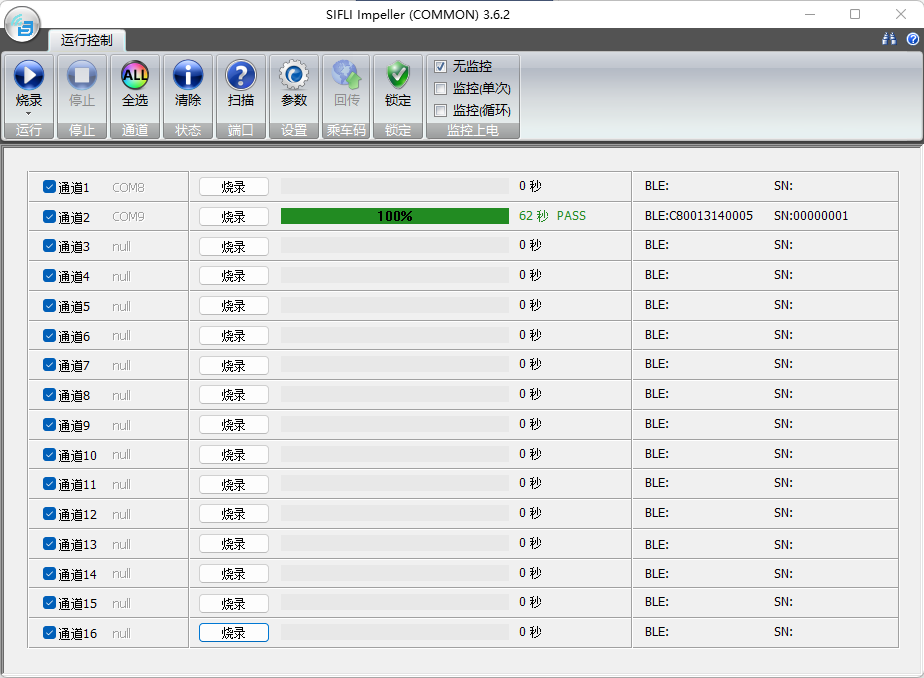
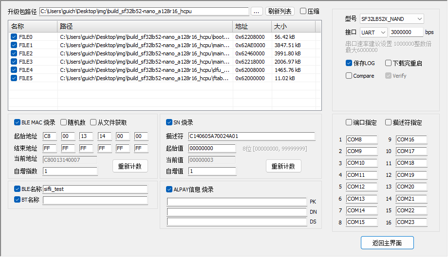

# Impeller

## 1 概述

Impeller 思澈公司自研工具，主要功用于产线生产，支持UART和JLink SWD两种接口方式，功能上支持固件烧录、FLASH擦除、48M晶体和电池测量校准、PCBA测试，最大支持16个同型号设备并行处理。\
工具路径：`tools/Impeller`

## 2 环境配置

Impeller 免安装，可直接运行于WINDOWS系统，WINXP/WIN7/WIN10/WIN11…

选择SWD接口方式下载时，需要基于Jlink硬件及其配套软件。建议操作如下：
1）购买官方Jlink设备并安装SEGGER官网JLink Windows驱动软件，本工具当前调试使用版本为V680a，建议软件安装在默认的C:\Program Files (x86)\SEGGER路径。  
2）SEGGER软件安装后，需要将其路径配置在工具的配置文件Impeller.ini中。eg：[COMMON_SET] -> JLINK_PATH=C:\Program Files (x86)\SEGGER\JLink  
3）将思澈产品的JLink烧录驱动拷贝到JLink安装路径（默认为C:\Program Files (x86)\SEGGER\JLink）。  

- 拷贝 "方案代码包\sdk\tools\flash\jlink_drv\JLinkDevices.xml"，覆盖到JLink安装路径下。  
- 在JLink安装路径下创建 Devices\SiFli 文件夹，将 "方案代码包\sdk\tools\flash\jlink_drv" 下所有子文件夹中的elf文件拷贝到 Devices\SiFli 文件夹。  

:::{note}
注意：若Jlink软件安装路径不同，仿照例子配置即可，并且需要将路径配置在工具的配置文件Impeller.ini中的JLINK_PATH项中。
:::

## 3 功能介绍

  

Impeller主界面如图所示，包括功能按钮区、运行显示区、参数配置页面等。

### 3.1 功能按钮

- **运行**  
  用于控制所有通道启动烧录/校准/擦除等流程，下面箭头点开可选择功能。  
- **停止**  
  用于控制所有通道停止运行。  
- **全选**  
  用于选择和取消选择所有通道。  
- **清除**  
  用于清除主显示区所有通道状态。  
- **扫描**  
  根据选择的端口类型和匹配搜索信息，扫描所有通道连接的设备端口。  
- **设置**  
  点击后弹出烧录文件及烧录端口参数设置界面，具体见后面章节描述。  
- **锁定**  
  点击后会锁定一些设置图标，避免产线上误触发修改参数。  
- **监控上电**  
  主要用于SF32LB52X系列芯片强制进入BOOT模式控制，该系列芯片无BOOT MODE管脚，如果需要在BOOT模式烧录则要设置该项参数，其他系列芯片一般不需要使用该参数。  
  - **无监控**  
    不监控板子上电信息。
  - **监控（单次）**  
    点击烧录或其他功能，启动后进入监控模式，检测到目标板上电再执行选择的功能，功能执行完成后流程结束。  
  - **监控（循环）**  
    点击烧录或其他功能，启动后进入监控模式，检测到目标板上电再执行选择的功能，功能执行完成后再进入监控模式。
- **擦FLASH**  
  - **擦除整片FLASH**  
    对于52X系列没有内置FLASH的芯片，如果外部存储器不使用NOR FLASH，产线上烧录MAC/SN/校准值会保存在外部存储器的指定地址区域，这部分数据在该操作下会被擦除掉。除此种场景外的其他场景，产线上烧录MAC/SN/校准值会保存OTP区域，不会受到影响。
  - **擦除非产线数据区**  
    该操作擦除时不会影响产线上烧录的MAC/SN/校准值等。
- **校准项**  
  - **48M晶体**  
    选择48M晶体校准功能。
  - **电池测量**  
    选择电池测量校准功能。
  - **校准参数**  
    - **电池的量校准参数**  
      - **参考电压**  
        从目标板VBAT输入的电压，校准是以这个值作为参考进行补偿。
      - **测量范围**  
        测量值同参考电压差值超过该范围认为环境异常，输出校准失败。
      - **校准精度**  
        校准补偿后，测量值同参考电压差值要满足的精度范围。
      - **电阻_大**  
        测量电池电压的两个分压电阻较大的一个阻值。
      - **电阻_小**  
        测量电池电压的两个分压电阻较小的一个阻值。
    - **48M晶体校准参数**  
      - **校准方式**  
        支持有线方式和无线方式，二者都是通过校准金机输出校准信号进行校准，建议采用无线方式校准。
      - **信道频率**  
        无线校准时金机使用的信道频率，工具设置需要同金机一致。
      - **信号管脚**  
        有线校准时目标板接收校准信号的管脚。
      - **校准时长**  
        校准流程最长时间，超过则会结束了流程报错。
      - **校准精度**  
        校准精度有校准算法决定，此参数目前无效。

### 3.2 运行显示区

运行显示区域显示16个通道的端口信息，运行状态信息，设备序列号信息，还可控制通道是否选择以及单独启动某个通道运行。

- **通道选择**  
  点击“全选”按钮，可以控制所有通道选择，也可单独点击控制通道选择。
- **端口信息**  
  点击“扫描”按钮，扫描各通道端口显示在通道信息区，无设备则显示“null”。
- **运行控制**  
  点击功能区“运行”控制所有通道开始运行，也可通过各通道的“运行”按钮单独控制通道，在通道启动后会显示为“停止”，此时点击会停止运行。
- **运行状态进度**  
  由进度条和静态文本显示运行的百分比信息以及最终结果。
- **运行时间**  
  显示选择功能运行所用的时间信息。
- **设备信息**  
  烧录时用来显示各通道设备的序列号和BLE MAC信息，校准时显示各校准项的运行结果

### 3.3 烧录参数设置界面

  

烧录参数设置界面如图所示，该页签主要控件功能描述如下：  

- **升级包路径**  
  可以将升级包路径粘贴在路径编辑框中，也可以通过编辑框后面的路径打开按钮选择路径，路径选择后如果固件包中有downfile.ini文件，则下发文件列表中会显示固件信息。  
- **文件列表**
  升级包路径更新后文件列表中会显示识别到的固件信息，列表中的文件全路径和地址两列可以通过双击编辑，编辑的内容不会保存，再次刷新列表会恢复。  
- **刷新列表**
  点击刷新列表，会选择列表中所有的文件吗，并且如果有修改的内容也会恢复。  
- **压缩**  
  勾选了压缩，部分设备类型的固件包会做压缩烧录以提高速度，支持压缩的设备类型在工具路径下的配置文件 Impeller.ini 的 [UART_COMPRESS] 配置中标注。不支持的设备勾选压缩不会有影响，所以建议使用时勾选压缩，除非发现压缩烧录有异常时可以取消压缩作对比。  
- **BLE MAC烧录**  
  选中该项，则可配置BLE MAC产生策略：
  - **随机产生**  
    这种方式高2Byte可设置固定值，后4Byte随机产生；
  - **固定递增**  
    按照固定差值递增方式产生。MAC地址如果是本地递增方式产生时，需要注意多个电脑使用时要把号段人为分开。  
  - **从文件获取**  
    MAC值保存在excel表中，保存在第一个页签的第一列，共三列，第一行为表头描述 MAC/备注/已使用。
  - **从网络获取**  
    从网络获取（部分客户从网络获取）跟客户的需求相关，需特殊定制。
- **SN烧录**  
  选中该项，则可配置SN产生策略，并在烧录时写入产生的SN内容，SN内容在烧录时保存ASCII码。SN由两部分组成，描述符是用户自定义的字符串，也可不填写，编号是5-9位10进制数字，起始值填写5位数字时，编号的最大值是99999，起始值填9位数字时，编号的最大值为999999999，描述符+编号不可超过64Byte。SN号也可根据客户需求从客户服务器获取，需特殊定制。
- **BLE NAME**  
  选中该项，则烧写BLE NAME，BLE NAME用字符串表示，不要超过29个字符，具体根据solution代码中使用限制。  
- **BT NAME**  
  选中该项，则烧写BT NAME，BT NAME用字符串表示，不要超过29个字符，具体根据solution代码中使用限制。  
- **ALPAY信息烧录**  
  选中该项，则烧写AL支付需要的信息。  
- **设备选择**  
  选择产品类型，在烧录时根据该选项选择对应的驱动文件。
- **接口选择**  
  选择UART端口或者JLink SWD端口下载， UART波特率目前设置范围在1000000-6000000，Jlink速率需要根据使用的设备设置，一般默认为5000。  
- **下载控制信息**  
  - **下载完重启**  
    勾选会在下载完成后重启设备，方便作其他操作。
  - **Compare**  
    勾选会先做比较操作，如果目的地址内容同下载内容一致则不会下载，产线上一般不选择该项。
  - **Verify**  
    勾选会在下载完后做校验，建议勾选确保下载正确。
  - **发送Reset命令**  
    使用JLink烧录时，勾选会在烧录前，先发送R命令复位CPU。
  - **发送Hold命令**  
    使用JLink烧录时，勾选会在烧录前，先发送H命令hold CPU。
  - **Jlink UI**  
    使用JLink烧录时，勾选会显示下载工具的UI界面，方便观察，多通道下载建议不勾选该项。
  - **ERR BOX**  
    使用JLink烧录时，勾选在下载遇到异常会弹出报错提示框，产线上建议关闭。
- **设备过滤**  
  设备过滤主要方便工具界面显示的通道信息跟实际物理连接做对应，可以快速区分下载异常的设备。如果设置了设备过滤，在主界面的通道信息上会显示各通道设置的设备，如果未设置设备过滤，则会将搜索出的设备按顺序显示在16通道上，多余的不会显示。
  - **UART通道过滤**  
    - **端口指定**  
      指定每个通道的串口号，实现工具界面的通道同设备一一对应。
    - **描述符指定**  
      如果使用的UART设备有内置的可用于保存信息的eeprom等芯片，则可以编辑其设备描述符，在驱动层面做出区分，这样指定每个通道的串口设备描述符内容，实现工具界面的通道同设备一一对应。
  - **JLINK通道过滤**  
    指定每个通道的JLink SN号，实现工具界面的通道同设备一一对应。

## 4 操作说明

### 4.1 产线使用准备工作

产线使用时，需要先做好**烧录参数设置页面**的配置，主要包括如下几项：

- 选择设备型号（设备型号是芯片型号+存储器类型）。
- 选择烧录设备及速率 产线一般用串口，速率设置需根据USB转串口芯片的能力，尽量设置高速率。
- 勾选**保存LOG**,不勾选**下载完重启**和**Compare**，**Verify**默认会勾选。
- 配置设备过滤策略，按照通道1-16连接的设备，一个个接入电脑，根据端口号或者描述符指定每个通道对应的信息。

### 4.2 烧录功能使用

- 主界面**运行**按钮的下箭头菜单中选择烧录功能，此时运行按钮及烧录页面的控制按钮显示为**烧录**。
- 点击主界面**参数**按钮，进入设置参数页面，选择升级包路径，根据需要勾选BLE MAC烧录、SN烧录等项目并做配置，然后点击**返回主界面**返回。
- 主界面各通道会显示连接的设备端口号，可以点击**烧录按钮**启动所有选择的通道烧录，或者点击各通道运行控制按钮启动烧录功能。烧录过程中可以通过点击停止按钮停止所有通道烧录，或者点击单个通道的停止按钮停止对应通道。
- 烧录完成后根据各通道的显示信息可以看到是否烧录成功。

### 4.3 校准功能使用

- 主界面**运行**按钮的下箭头菜单中选择校准功能，此时运行按钮及烧录页面的控制按钮显示为**校准**。
- 在功能区的校准项中根据需要勾选校准项目，点击校准项的参数设置，设置校准时的参数，参考3.1节**校准项**描述。正常情况下可以直接使用默认设置的参数，设置完参数后关闭该窗口。
- 可以点击**校准按钮**启动所有选择的通道校准，或者点击各通道运行控制按钮启动校准功能。校准过程中可以通过点击停止按钮停止所有通道校准，或者点击单个通道的停止按钮停止对应通道。
- 校准完成后根据各通道的显示信息可以看到是否校准成功。

### 4.4 擦除功能使用

- 主界面界面**运行**按钮的下箭头菜单中选择擦除功能，此时运行按钮及烧录页面的控制按钮显示为**擦除**。
- 在擦FLASH区根据需要勾选擦除的项目，参考3.1节**擦FLASH**描述。
- 可以点击**擦除按钮**启动所有选择的通道擦除，或者点击各通道运行控制按钮启动擦除功能。擦除过程中可以通过点击停止按钮停止所有通道擦除，或者点击单个通道的停止按钮停止对应通道。
- 擦除完成后根据各通道的显示信息可以看到是否擦除成功。

### 4.5 校准加烧录功能使用

- 主界面**运行**按钮的下箭头菜单中选择**烧录+校准**功能，此时运行按钮及烧录页面的控制按钮显示为**烧+校**。
- 配置项结合5.2和5.3节描述。
- 该功能会先做校准，然后再做下载，结束后有总结果及各分项结果显示。
