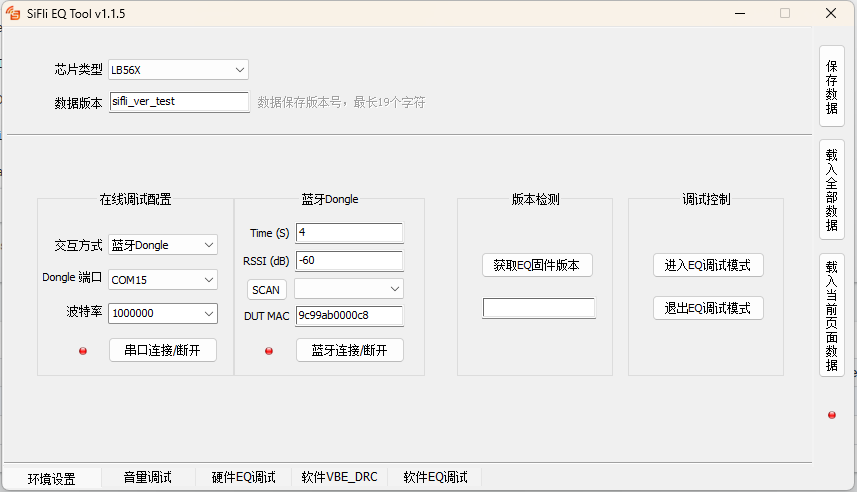
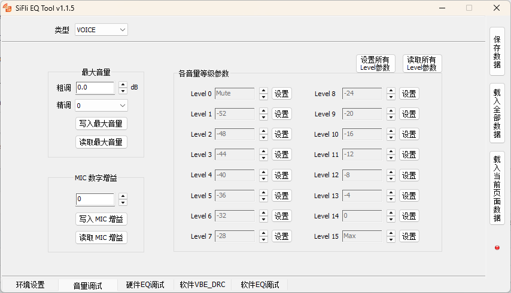
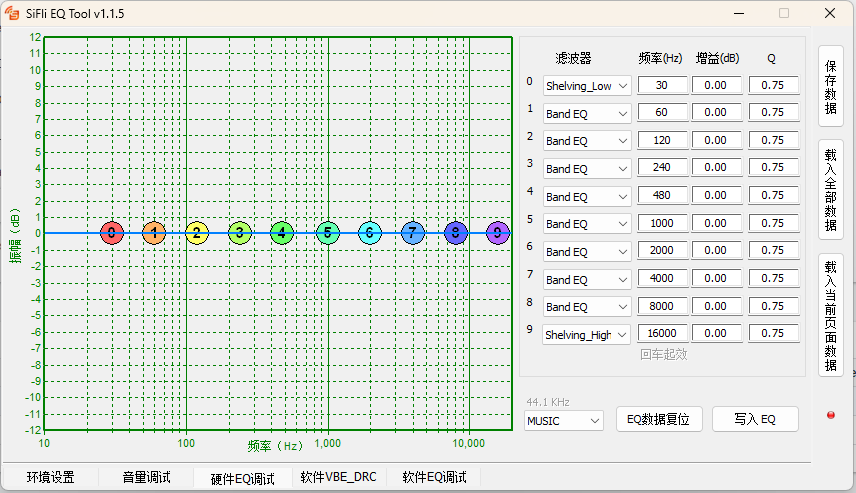
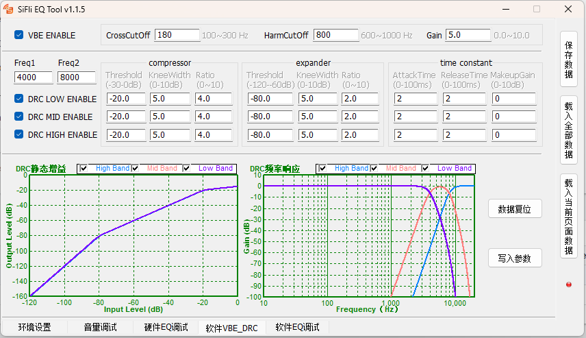

# SiFli_EQ

## 1. 概述

SiFli_EQ 是思澈公司自研工具，主要功能是配置目标板的音量等级、VBE、DRC、EQ等参数，用于音频EQ调试。\
工具路径：`tools/SiFli_EQ`

## 2. 环境配置

SiFli_EQ 免安装，可直接运行于WINDOWS系统，WINXP/WIN7/WIN10/WIN11…

EQ工具首次使用需要注册插件，首次使用请用管理员权限打开来，避免插件注册失败。

EQ工具如果用串口的话，使用log系统和板子交互，板子的LOG_I等级要打开，LOG_D等级要关闭，不然log太多影响交互正确性

## 3. 功能介绍

Audio处理流程：  
VBE(crossover filter -> vbe -> slopefilter) -> SOFT EQ -> DRC(crossover filter -> three-band DRC) -> HARD EQ -> Audio DAC

工具有5个页签：环境设置、音量调试、硬件EQ调试、软件VBE_DRC、软件EQ调试。

### 3.1 公共参数  

- **保存数据**  
  点击该按钮，会将工具几个页面的数据都保存下来，包括工具界面配置和生成的参数。
- **载入全部数据**  
  载入全部数据会将保存的数据恢复到各个页面中。
- **载入当前页面数据**  
  载入当前页面数据只会获取保存数据中跟当前页面相关的数据恢复，其他页面保持不变。
- **目标板连接指示灯**  
  当调试工具同目标板建立连接后，指示灯为绿色，表示可以进行在线调试，即可以从目标板获取参数，也可以把参数配置到目标板中。

### 3.2 环境设置  

  

环境设置页签如图所示，主要控件及功能描述如下：

- **芯片类型**  
  不同的芯片类型部分参数可能会有差异，目前该参数未使用。  
- **数据版本**  
  生成数据的版本名称，最长19个字符，方便版本记录。  
- **在线调试配置**  
  - **交互方式**  
  在线调试需要先设置交互通道，支持DUT串口方式和蓝牙Dongle的方式。  
  - **DUT串口方式**  
    直接通过目标板的HCUP Trace端口发送命令进行交互，需要目标板有Trace端口引出。  
    - **DUT端口**  
      选择目标板的HCPU Trace端口号。  
    - **波特率**  
      选择目标板的HCPU Trace端口设置的波特率，一般为1000000。  
    - **串口连接断开**  
      控制串口的连接及断开，连接上后指示灯为绿色，可以进行后面的在线调试。  
  - **蓝牙Dongle方式**  
    通过蓝牙Dongle的Trace端口进行交互，蓝牙模组同目标板通过空口交互，转发双方的信息，这对于没有Trace口引出的目标板比较方便。蓝牙Dongle由思澈公司提供，请联系FAE获取 [TBD]。  
    - **Dongle 端口**  
      选择蓝牙Dongle的Trace端口号。  
    - **波特率**  
      选择蓝牙Dongle的Trace端口设置的波特率，一般为1000000。  
    - **串口连接断开**  
      控制串口的连接及断开，连接上后指示灯为绿色，可以扫描目标板的蓝牙信号做下一步操作。  
    - **Time**  
      设置扫描目标板信号的时间。  
    - **RSSI**  
      设置扫描时过滤的RSSI门限，低于该门限不显示。  
    - **SCAN**  
      扫描BLE信号并显示在列表中。  
    - **DUT MAC**  
      指定目标板MAC地址进行连接，如果指定MAC则不需要前面的扫描步骤。
    - **蓝牙连接/断开**  
      Dongle同目标板蓝牙进行连接，连接成功指示灯为绿色，可以进行后面的在线调试。
- **版本检测**  
  在通道建立后，点击**获取EQ固件版本**，如果获取不到则表示无法使用该工具，获取到的版本号后面会做工具匹配检测， 目前未使用。
- **调试控制**  
  在线调试需要进入EQ调试模式，这样工具下发的参数可以控制手表的音量等，退出EQ调试模式后，音量可以通过手机控制。

### 3.3 音量调试

  

音量调试页签如图所示，主要控件及功能描述如下：

- **类型**  
  VOICE和MUSIC两种，两种类型的参数是分开调试的。
- **最大音量**  
  - **粗调**  
    0.5db为单位增减。
  - **精调**  
    精调分7个等级，一般选择0表示不用。最大音量调整精度是0.5dB，如果对精度要求更高时，可以设置精调值，值越大，衰减越多。
  - **写入最大音量**  
    将音量编辑框中音量值写入到目标板。
  - **读取最大音量**  
    读取目标板中的最大音量值，显示在音量编辑框中。
- **MAC数字增益**  
  - **增益值**  
    0 - 13 dB范围。
  - **写入MIC增益**  
    将编辑框中的MIC增益值写入到目标板。
  - **读取MIC增益**  
    读取目标板中的MIC增益值，显示在编辑框中。
- **各音量等级参数**  
  - **设置所有Level参数**  
    将16个Level的等级值写入到目标板。
  - **读取所有Level参数**  
    读取目标板中16个Level的等级值，显示在编辑框中。
  - **各Level设置**  
    每个Level单独配置，可以单独写入到目标板。注意最后一个Level的值不会超过最大音量的设置值，第一个Level的值不会低于-54。

### 3.4 硬件/软件EQ调试  

   

EQ调试页签如图所示，硬件EQ和软件EQ的操作方式基本相同，硬件EQ可配置10个点的滤波参数,软件EQ可以设置32个点的滤波参数。  

- **滤波器参数设置**  
  选择右边一个点的滤波器类型，设置频率、增益、Q值。在左边图形区域，可拖动图标，修改对应点的频率和增益值。频率范围为 10Hz ~20KHz；增益范围 -12dB ~12 Db；Q 值范围为 0.05~20；
- **EQ数据复位**  
  所有点的参数都会被重置。  
- **写入EQ**  
  把当前EQ写入到设备内存中。

### 3.5 软件VBE/DRC  

   

软件VBE/DRC页签如图所示，参数都是比较专业的滤波器先关参数，有注释取值范围。  

- **VBE ENABLE**  
  VBE 功能开关。
- **Freq1 Freq2**
  DRC crossover 滤波器参数。  
- **DRC LOW/MID/HIGH ENABLE**  
  DRC 各频段使能开关。
- **数据复位**  
  将所有参数恢复到默认值。
- **写入参数**  
  将界面参数计算结果写入到目标板。

## 4. 板子设置
板子代码在drv_audprc.c中，为了写入EQ后，不用每次开机都要写入，会把当前调试的参数写入EQ_DEBUG_FILE_PATH这个文件里，需要系统配置了文件系统才行， 再重启就从EQ_DEBUG_FILE_PATH里加载eq参数。要根据系统情况修改这两个宏，比如没有/dyn/目录，那写入EQ_DEBUG_FILE_PATH就可能失败，目前系统要求目录已经存在了才能写入文件。  

#define EQ_DEBUG_FILE_PATH      "/dyn/eq_debug.bin"  
#define EQ_SYSTEM_FILE_PATH     "/eq.bin"  

上面EQ参数优先使用的顺序从高到底是  
  - EQ_DEBUG_FILE_PATH
  - EQ_SYSTEM_FILE_PATH
  - 代码中的参数  

其中EQ_DEBUG_FILE_PATH是给调试者临时用的，正式版本里是不能有这个文件的。EQ_SYSTEM_FILE_PATH是产品里，需要产线烧录或升级的，具体目录由产品决定，这里只是例子放在根目录。    
/dyn/eq_debug.bin 退出EQ调试模式时会生成。  
/eq.bin 在EQ工具点击保存数据时生成并烧到或OTA到设备里的文件。  
生成的代码要合入到drv_audprc.c里  
int8_t g_tel_vol_level[16] = {};为电话时16个音量等级对应的增益值, 1db为单位  
int8_t g_music_vol_level[16]= {};为非电话时16个音量等级对应的增益值, 1db为单位  
g_tel_max_vol为电话时的最大增益，0.5db为单位，g_tel_vol_level[]的值都要小于等于g_tel_max_vol * 2  
g_music_max_vol为非电话时的最大增益，0.5db为单位，g_music_vol_level[]的值都要小于等于g_music_max_vol * 2  
如果想简单改变音量，可以手动改数组里的值，但是函数返回的音量等级对应的增益(返回0.5db为单位)会和最大增益比较，如果比最大增益大，则返回电话或非电话的最大增益，手动修改时要注意。

## 5. 使用方法

工具使用比较简单，但是修改调试的内容有其专业性，需要对音频及滤波器相关知识比较熟悉，此处不做描述。
