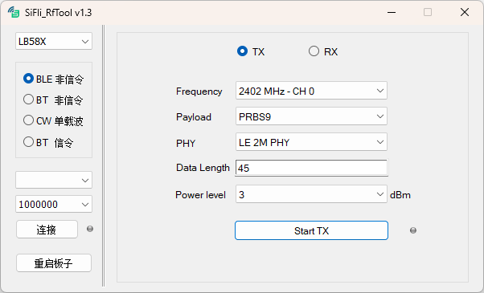

# SiFli_RfTool

## 1. 概述

SiFli_RfTool 是思澈公司自研工具，主要功能是测试 BLE/BT 射频收发性能，该工具存放在 **固件包\solution\tools\SiFli_RfTool** 路径下。

该工具是配合测试固件使用的，思澈公司会提供用来做射频测试的RF测试固件，目前暂无固定的发布链接，请联系FAE获取 [TBD] ，用户也可以使用客户的标准固件来进行测试，用户固件中针对RF测试需要做的配置注意事项请联系FAE支持 [TBD]。

## 2. 环境配置

SiFli_RfTool 免安装，可直接运行于WINDOWS系统，WINXP/WIN7/WIN10/WIN11…

## 3. 功能介绍

  
  
工具主界面如图所示，主要包括2个区域，左侧是基本控制区，右边是功能测试区。  

- **平台选择**  
  选择芯片类型，LB58X/LB52X/LB56X/LB55X，其中LB55X是BLE单模芯片，不支持BT相关测试。
- **功能选择**  
  - **BLE非信令**  
    进行BLE非信令测试，控制目标板接收或发送BLE特定数据。
  - **BT非信令**  
    进行BT非信令测试，控制目标板接收或发送BT特定数据。
  - **CW单载波**  
    控制目标板发送指定频点的单载波非调制信号。
  - **BT信令**  
    发送命令给目标板进入BT信令测试模式，信令测试模式下，测试仪表同目标板通过空口信令交互完成测试，不再需要工具参与。
- **串口选择**  
  选择芯片UART1作为命令交互通道。
- **波特率设置**  
  波特率设置跟测试固件配置有关，默认情况下为1000000。
- **串口连接/断开**  
  工具打开串口连接，在连接状态下点击则断开串口连接，连接成功后面状态指示灯为绿色。
- **重启板子**  
  发送命令给目标板重启。
- **功能测试**  
  功能测试界面显示当前选中功能的配置参数，参数项为BT/BLE测试专业参数，设定好参数后点击发送或接收按钮启动测试。

## 4. 使用方法

工具使用比较简单，直接双击运行，执行步骤如下：

:::{note}
RF测试可以使用思澈公司提供的RF测试固件，也可以使用客户的标准固件，使用用户固件时需要先通过HCPU工程的Trace口发送 **bt_cm uart_dut** 命令，切换UART1为HCI模式。
:::  

- 根据目标板选择芯片类型；
- 选择要使用的功能；
- 选择芯片UART1在PC上对应的串口号；
- 选择波特率（如无特殊修改默认为1000000）；
- 点击 **连接** 按钮，状态指示灯为绿色；
- 在功能测试界面选择测试参数；
- 点击 **Start TX/RX**，指示灯为绿色；
- 完成测试后点击 **Stop TX/RX**结束测试，RX测试会显示RSSI以及误包率等信息。
