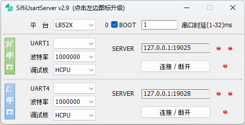

# UsartServer

## 1. Overview

UsartServer is an in-house tool developed by SiFli Technology. It is a companion tool for debugging via the chip's built-in Debug IP. The SF32LB52X and SF32LB56X chip series produced by SiFli Technology have an integrated Debug IP that enables debugging over a serial port.\
Tool path: `tools/UsartServer`

## 2. Environment Setup

UsartServer requires no installation and runs directly on Windows (XP / 7 / 10 / 11 …).

## 3. Features



The main interface is shown above. Key controls are described below:

- **Platform**
  Selects the chip type: LB52X or LB56X.
- **BOOT**
  Forces SF32LB52X-series chips into BOOT mode. The SF32LB52X series has no BOOT MODE pin; to enter BOOT mode, a command must be sent over UART1 within 2 seconds of chip startup. This function has no effect on other chip families. The counter on the left of the control increments each time the tool detects a startup signal and successfully forces the chip into BOOT mode. This switch must be turned off during normal use; otherwise the board cannot boot into user firmware.
- **Serial Latency**
  FTDI USB-to-serial adapter drivers introduce a latency parameter. When this value is large, it reduces the interaction speed. It is recommended to set it to 1 ms using this control. This setting may not be effective for USB-to-serial adapters from other manufacturers.
- **H Serial Port**
  By default, the tool opens with one debug interface (UART1 only). Double-click this control to open the UART4 debug interface if two debug ports are needed simultaneously.
- **Port Number**
  The COM port number corresponding to UART1 / UART4.
- **Baud Rate**
  Sets the serial port baud rate. The initial baud rate must match the rate configured in the firmware (typically 1000000). After connecting, changing the baud rate here also changes the baud rate in the firmware. Increasing the baud rate speeds up interaction. The board reverts to the firmware's default baud rate after a power cycle.
- **SERVER**
  The address and port that this tool exposes as a server for other tools to connect to. Default values are pre-configured. Each SERVER supports up to 2 simultaneous connections; the indicator turns green when a client is connected.
- **Connect / Disconnect**
  Opens the serial connection and sends commands to enable the debug interface. The indicator turns green when the serial connection is established and the debug interface is active. If the serial port connects successfully but the debug interface handshake fails, the indicator shows grey.

## 4. Usage

The tool is straightforward to use. Double-click to open it and follow the steps below:

- Select the chip type based on the target board.
- Select the UART1 COM port number, baud rate, and the CPU core to debug.
- Click **Connect**; the indicator turns green.
- Configure the third-party debugging tool to connect via IP (see the configuration notes below).
- Once the third-party tool connects, the SERVER indicator turns green, indicating that debugging can proceed normally.

Configuration notes for common ARM debugging tools:

- **JLink Commander**
  Open JLink Commander. If another JLink device is connected to the PC, it will be selected by default — enter the command `ip 127.0.0.1:19025` in JLink Commander to switch to the serial debugger. If no other JLink device is connected, a dialog will appear asking for the device address — enter `127.0.0.1:19025` in the Identifier field (UsartServer copies this address to the clipboard when it connects, so you can paste it directly). Click Yes; the tool will show the device as connected, and the UsartServer SERVER indicator will turn green.

- **Keil**
  Open the project in Keil. Go to **Project → Options for Target → Debug → Use J-LINK/J-TRACE Cortex → Settings → Debug**, set **Interface** to **TCP/IP**, set **IP-Address** to `127.0.0.1`, and set **Port** to `19025`. Click **Connect** in the Interface section. If the UsartServer SERVER indicator turns green, the connection was successful.

- **Ozone**
  Open Ozone. The New Project Wizard dialog will appear (or open it via **File → New → New Project Wizard**). On the second page, **Connection Settings**, set **Target Interface** to **SWD**, **Host Interface** to **IP**, and **IP Address** to `127.0.0.1:19025` (UsartServer copies this address to the clipboard when it connects, so you can paste it directly). Complete the project creation wizard. When debugging starts, the UsartServer SERVER indicator will turn green.

- **JLink.exe (command line)**
  When calling `JLink.exe` from the command line to run JLink scripts for read/write operations, add `-ip 127.0.0.1:19025` to use the serial debugger. e.g.:
  ```
  JLink.exe -ip 127.0.0.1:19025 -device SF32LB52X_NOR -if SWD -speed 4000 -autoconnect 1 -CommandFile SF32LB52X_BURN.jlink
  ```
